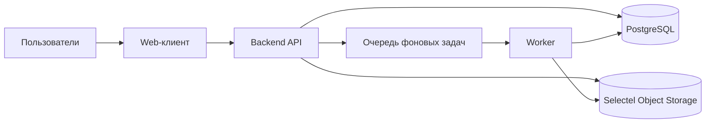
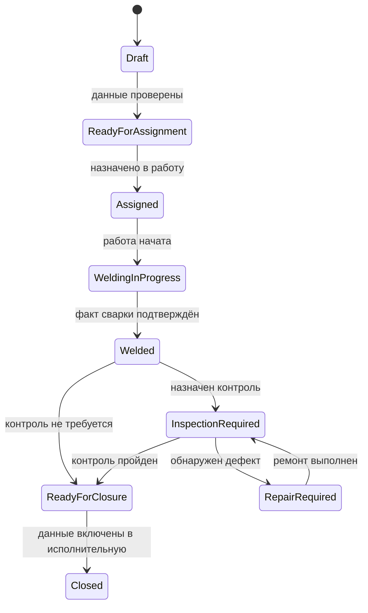
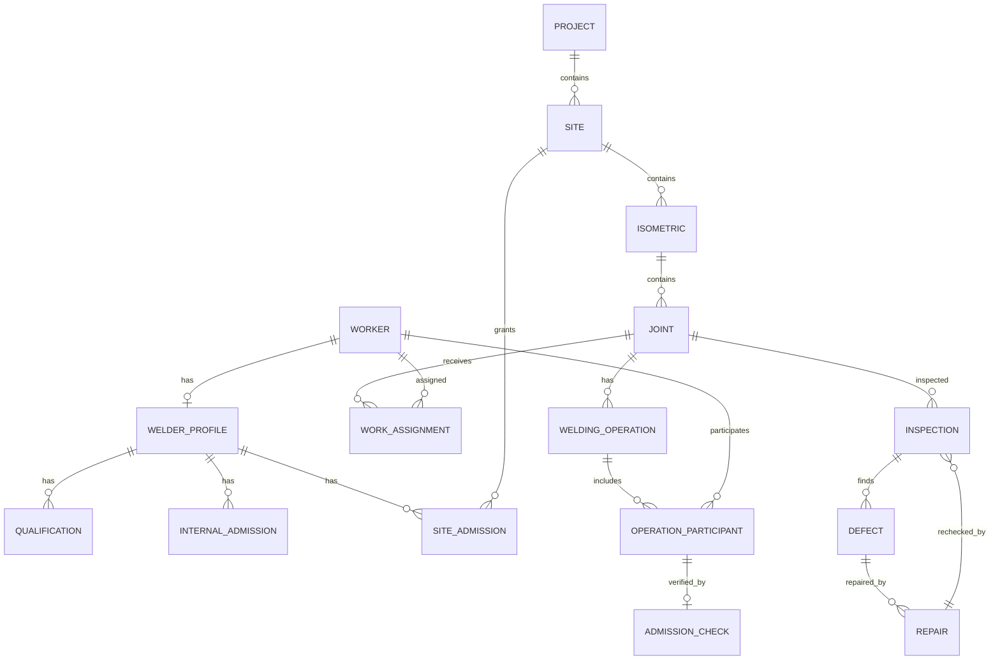
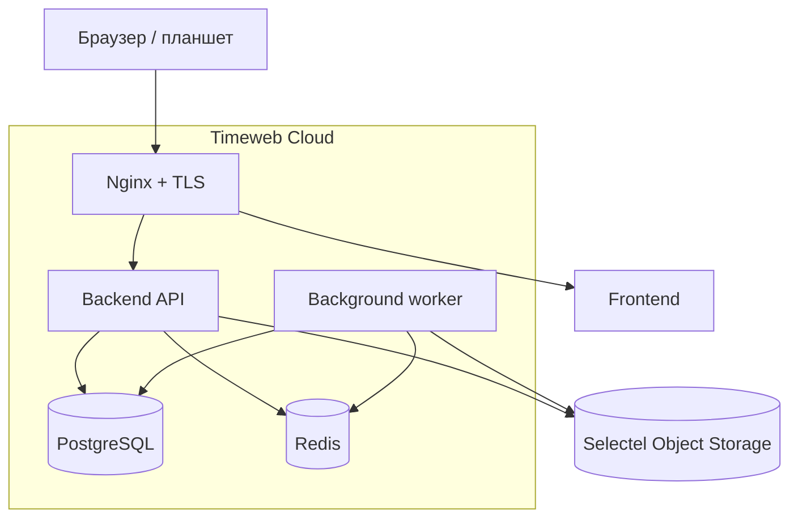

# Архитектура WeldPassport

## 1. Архитектурное решение

Для MVP используется **модульный монолит**:

- web-клиент;
- единый backend API;
- PostgreSQL как основное хранилище;
- объектное хранилище для файлов;
- фоновые задачи для отчётов, импорта и уведомлений.

Микросервисы на первом этапе не нужны: основные операции проходят через один
сквозной производственный процесс и должны фиксироваться одной транзакцией.
Разделение выполняется внутри приложения по предметным модулям.



## 2. Рекомендуемый технологический стек

### Backend

- Python 3.12;
- FastAPI;
- SQLAlchemy 2;
- Alembic;
- Pydantic;
- PostgreSQL 16;
- Celery или Dramatiq для фоновых задач;
- Redis как очередь и краткоживущий кэш.

### Frontend

- React + TypeScript;
- Vite;
- React Query;
- React Hook Form;
- компонентная библиотека Ant Design или MUI.

Для цеховых планшетов на первом этапе достаточно адаптивного web-интерфейса.
Отдельное мобильное приложение следует рассматривать после стабилизации
производственного процесса.

### Инфраструктура

- Docker Compose для разработки и первого развёртывания;
- Timeweb Cloud для размещения backend;
- PostgreSQL в Timeweb Cloud;
- Nginx с TLS перед backend;
- Selectel Object Storage через S3-совместимый API;
- резервное копирование PostgreSQL и файлового хранилища;
- централизованные логи.

## 3. Предметные модули

Backend делится на следующие модули:

| Модуль | Ответственность |
|---|---|
| `identity` | пользователи, роли, права, сессии |
| `projects` | проекты, объекты, участки |
| `engineering` | изометрии, ревизии, стыки, WPS |
| `workforce` | работники, сварщики, документы, аттестации |
| `admissions` | внутренние допуски, допуски заказчика, проверка права на сварку |
| `production` | задания, назначенные участники, подготовка, факт сварки |
| `quality` | виды контроля, результаты, дефекты, ремонты, повторный контроль |
| `documents` | вложения, версии файлов, исполнительные журналы |
| `reporting` | реестры, сводки, выгрузки Excel/PDF |
| `audit` | история изменений и значимых действий |

Модули не обращаются напрямую к внутренним таблицам друг друга. Внутри
монолита они взаимодействуют через сервисы приложения и явные интерфейсы.

## 4. Слои backend

```text
API
  -> Application services / Use cases
      -> Domain rules
          -> Repository interfaces
              -> SQLAlchemy repositories
                  -> PostgreSQL
```

- **API** проверяет формат запроса, аутентификацию и переводит ошибки в HTTP.
- **Application services** управляют сценарием и транзакцией.
- **Domain rules** содержат правила допуска, переходов статуса и закрытия.
- **Repositories** изолируют запросы к базе данных.
- SQLAlchemy-модели не должны одновременно быть API-схемами.

Пример use case:

```text
RecordWeldingFact
1. Загрузить стык и его текущий статус.
2. Проверить право пользователя на действие.
3. Проверить действующий допуск каждого фактического сварщика.
4. Зафиксировать участников и факт сварки.
5. Сохранить снимок результата проверки допуска.
6. Изменить статус стыка.
7. Записать событие аудита.
8. Зафиксировать всё одной транзакцией.
```

## 5. Главный агрегат и жизненный цикл

Центральная сущность системы — **стык**. Проект, объект и изометрия задают его
контекст, а производство и контроль формируют историю исполнения.



Статус стыка нельзя менять произвольным редактированием поля. Каждый переход
оформляется отдельной командой с проверкой условий.

## 6. Ключевые правила модели данных

### Разделять человека и системного пользователя

- `worker` — физический работник предприятия;
- `welder_profile` — специализация работника как сварщика;
- `user_account` — учётная запись для входа в систему.

Не каждый работник имеет учётную запись, и не каждый пользователь является
работником.

### Разделять назначение и факт

Необходимо хранить отдельно:

- назначенного сварщика;
- фактического сварщика;
- участника подготовки;
- пользователя, внёсшего данные;
- сотрудника, подтвердившего факт;
- сварщика, указанного в исполнительной документации.

Это разные роли, даже если в конкретной записи их выполняет один человек.

### Допуск — результат правил, а не флаг

Проверка допуска должна учитывать:

- срок действия документов и аттестаций;
- способ сварки;
- группу материала;
- диапазон диаметров и толщин;
- тип соединения и положение сварки;
- внутренний допуск;
- допуск к объекту или проекту;
- дату выполнения работы.

Результат проверки сохраняется как неизменяемый снимок:

```text
admission_check
- worker_id
- joint_id
- checked_at
- work_date
- decision: allowed / denied / warning
- rule_version
- reasons[]
- source_document_ids[]
```

Это позволяет позднее доказать, почему система разрешила или запретила работу.

### История вместо перезаписи

Факты производства, результаты контроля, ремонты и допуски не удаляются и не
перезаписываются без следа. Исправление создаёт новую версию или корректирующую
запись. Для справочных данных допустимо мягкое удаление.

### Файлы отдельно от базы

В PostgreSQL хранится только метаинформация:

- владелец и тип документа;
- версия;
- имя и MIME-тип;
- размер;
- контрольная сумма;
- ключ объекта в Selectel Object Storage;
- кто и когда загрузил.

## 7. Минимальная структура данных MVP



Для числовых характеристик нельзя использовать строки:

- диаметр и толщина — `numeric`;
- диапазоны допуска — отдельные `min`/`max`;
- даты — `date` или `timestamptz`;
- статусы и виды — справочники либо ограниченные enum-значения.

Идентификаторы рекомендуется хранить как UUID, а человекочитаемые номера
проекта, изометрии и стыка — как отдельные бизнес-ключи с уникальными
ограничениями в своём контексте.

## 8. Авторизация

Используется RBAC с ограничением по области действия:

```text
permission = действие + тип ресурса
scope = организация / проект / объект
```

Примеры:

- ПТО может редактировать изометрии только доступных проектов;
- мастер может фиксировать факт по своему объекту;
- НК может вносить результаты контроля, но не менять факт сварки;
- главный сварщик управляет допусками;
- руководитель имеет доступ только на чтение и к отчётам.

Проверка прав выполняется на backend. Скрытие кнопки во frontend не считается
защитой.

## 9. API

Для MVP подходит REST API:

```text
/api/v1/projects
/api/v1/sites
/api/v1/isometrics
/api/v1/joints
/api/v1/workers
/api/v1/welders
/api/v1/admission-checks
/api/v1/work-assignments
/api/v1/welding-operations
/api/v1/inspections
/api/v1/reports
```

Бизнес-действия оформляются командами, а не универсальным обновлением статуса:

```text
POST /joints/{id}/assign
POST /joints/{id}/record-welding
POST /joints/{id}/request-inspection
POST /inspections/{id}/record-result
POST /defects/{id}/record-repair
POST /joints/{id}/close
```

Для защиты от повторной отправки мобильным интернетом команды записи должны
поддерживать `Idempotency-Key`.

## 10. Аудит и наблюдаемость

Для значимых действий сохраняются:

- пользователь;
- время;
- тип действия;
- сущность и её ID;
- старое и новое значение;
- причина исправления;
- IP и идентификатор запроса.

Пароли, токены и содержимое файлов в аудит не записываются.

Каждый запрос получает `correlation_id`, который проходит через API, фоновые
задачи и журналы приложения.

## 11. Развёртывание MVP



Backend, worker, Redis и PostgreSQL размещаются в Timeweb Cloud. Файлы хранятся
отдельно в Selectel Object Storage. Доступ к PostgreSQL должен быть разрешён
только из приватной сети backend и с административных адресов через защищённый
канал.

Для PostgreSQL настраиваются автоматические резервные копии и проверка
восстановления. Доступ к Selectel выполняется по HTTPS через отдельного
сервисного пользователя с минимально необходимыми правами на бакет.

## 12. Структура исходного кода

```text
backend/
  app/
    identity/
      api.py
      schemas.py
      services.py
      domain.py
      repository.py
      models.py
    projects/
    engineering/
    workforce/
    admissions/
    production/
    quality/
    documents/
    reporting/
    audit/
    shared/
      db.py
      errors.py
      security.py
  migrations/
  tests/

frontend/
  src/
    app/
    pages/
    features/
    entities/
    shared/
```

## 13. Этапы реализации

> **Сварной стык** остаётся центральной сущностью **производственного** контура
> (см. §5 и подраздел «Приоритет первого вертикального сценария»), но первым
> полностью реализуемым вертикальным сценарием является **кадрово-допусковый
> контур**; жизненный цикл стыка — второй.

1. Каркас приложения, миграции, пользователи, роли и аудит.
2. Работники, сварщики, документы, аттестации, внутренний допуск ОГС, разрешение
   на сварку, допуск заказчика — полный жизненный цикл работника до состояния
   «готов к назначению на объект».
3. Проекты, объекты, изометрии и стыки — второй вертикальный сценарий;
   жизненный цикл сварного стыка.
4. Назначение и фиксация факта сварки.
5. Контроль, дефекты, ремонт и повторный контроль.
6. Исполнительный журнал и выгрузки.
7. Импорт исходных реестров и эксплуатационные отчёты.

## 14. Решения, которые нужно уточнить до реализации

- нужна ли работа при нестабильной связи;
- кто окончательно подтверждает факт сварки;
- допускается ли несколько сварщиков и несколько проходов на одном стыке;
- какие виды НК обязательны и как определяется объём контроля;
- какие формы журналов и актов являются первыми обязательными выходными
  документами;
- нужна ли интеграция с Active Directory, 1С или внешней системой ПТО.

## 15. Владельцы данных по доменам

| Домен | Владелец |
|---|---|
| Работники | ОК |
| Сварщики | ОГС |
| Допуски | ОГС |
| Производство | СМР |
| Контроль качества | ОТК |
| Исполнительная документация | ПТО |
| Нормирование | ОГС |
| Справочники | Администратор |

> Роль «СМР» здесь новая относительно `05_Роли_и_права/WeldPassport_Роли_пользователей_v0.1.md` —
> при следующей проработке ролей сверить и привести к единому списку.

## 16. Статус backend-кода (зафиксировано 01.07.2026)

`09_Разработка/backend` принят как основная архитектурная база MVP: уже есть
рабочее разделение `api / schemas / services / repository / models / shared`,
стек соответствует §2 (FastAPI, SQLAlchemy 2, PostgreSQL, Alembic, Pydantic
Settings). Backend не переписывается с нуля.

Первоочередные задачи стабилизации:

- исправить кодировку UTF-8;
- создать первую Alembic-миграцию;
- добавить базовые тесты;
- определить дальнейшую судьбу `09_Разработка/src` (действующие модели и
  скрипты) — влить в `backend` или оставить как отдельный слой импорта/скриптов.

> Раздел перенесён из `docs/architecture/ARCHITECTURE_DECISIONS.md` (ADR-0011),
> файл в архиве — см. `2026-07-01_Ревизия_md_файлов_v1.md`.

## Архитектурная веха — 2026-07-01

По итогам независимой архитектурной ревизии (три согласованных анализа) зафиксировано:

- архитектура проекта признана **стабильной** — дальнейшая работа ведётся в рамках
  принятых решений, без пересмотра фундамента;
- **`09_Разработка/backend`** остаётся основной архитектурной базой MVP;
- **модульный монолит** подтверждён как целевой стиль backend;
- **PostgreSQL** подтверждён как единственная основная СУБД;
- отдельный **ETL-слой** на данном этапе **не создаётся** — импорт и обработка
  данных остаются внутри backend (Import Pipeline);
- разработка переходит от этапа **проектирования** к **инженерной реализации**;
- дальнейшая разработка ведётся **вертикальными бизнес-сценариями** (end-to-end
  по предметной области), а не горизонтальным наращиванием отдельных слоёв.

Подробные решения ревизии — в `docs/project/DECISIONS.md`.

### Приоритет первого вертикального сценария

Первым **полностью реализуемым** бизнес-процессом проекта становится не сварной
стык, а **полный жизненный цикл работника**.

Последовательность:

```
Человек
  ↓
Приём на работу
  ↓
Работник
  ↓
Сварщик
  ↓
Документы
  ↓
Аттестации
  ↓
Внутренний допуск ОГС
  ↓
Разрешение на сварку
  ↓
Допуск заказчика
  ↓
Готов к назначению на объект
```

Производственный процесс невозможно реализовать корректно без полноценной модели
работника, сварщика, аттестаций, внутреннего допуска, допуска заказчика и
разрешения на выполнение сварочных работ. **Только после прохождения этого
контура** работник может участвовать в производственном жизненном цикле сварного
стыка (назначение, подготовка, факт сварки, контроль, закрытие).

Вторым вертикальным сценарием остаётся полный жизненный цикл сварного стыка.
См. также `docs/project/DECISIONS.md` (запись «Изменение стратегии разработки»).

**Сварной стык** остаётся **центральной сущностью производственного контура**, но
первый этап разработки начинается с **кадрово-допускового контура** (цепочка
выше). Производственный контур невозможно реализовать корректно, если сначала не
создан фундамент: человек, приём на работу, работник, сварщик, документы,
аттестации, внутренний допуск ОГС, разрешение на сварку, допуск заказчика.
Только после этого работник может быть назначен на объект и участвовать в
жизненном цикле сварного стыка.

Краткая цепочка:

```
Человек → Приём на работу → Работник → Сварщик → Документы → Аттестации →
Внутренний допуск ОГС → Разрешение на сварку → Допуск Заказчика →
Готов к назначению на объект
```
