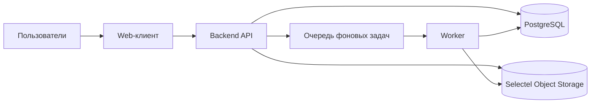
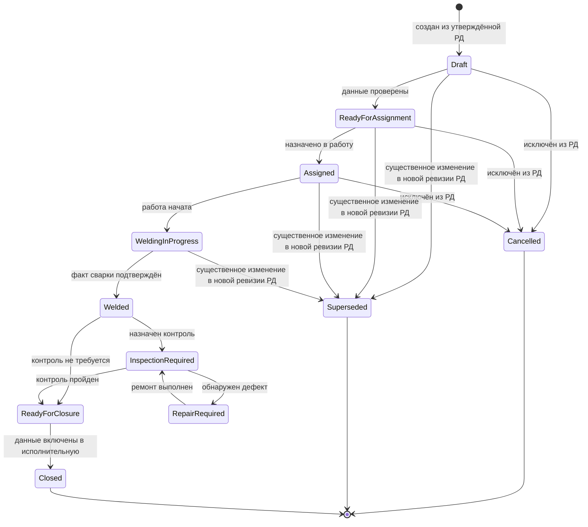
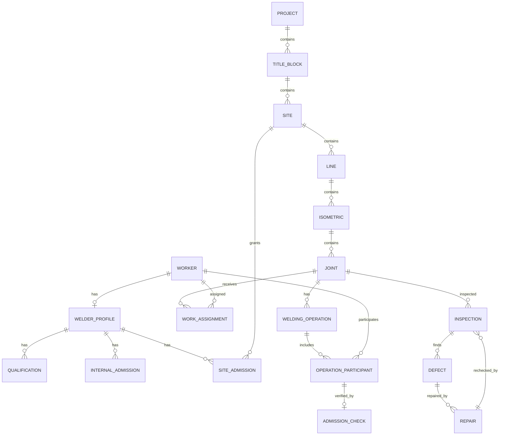
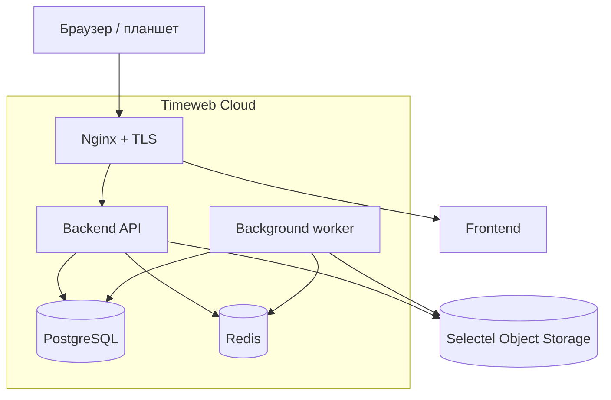

# Архитектура WeldPassport

> Главный архитектурный документ — [[docs/project/CONSTITUTION|Конституция проекта]].
> **Принцип №0 / AGF:** фундаментальные решения — только по
> [[docs/project/ARCHITECTURE_GOVERNANCE|Architecture Governance Framework]]:
> Session → ADR → документация → код
> ([[docs/project/CONSTITUTION#5. Architecture Governance|Конституция §5]]).  
> **Принцип №2:** новые сущности — сначала в
> [[docs/project/UBIQUITOUS_LANGUAGE|Ubiquitous Language]] (статус «Канон»);
> [[docs/project/CONSTITUTION#4. Архитектурный принцип №2. Канонический язык проекта|Конституция §4]].
> Этот файл описывает техническую реализацию принятых решений.

## 1. Архитектурное решение

Для MVP используется **модульный монолит**:

- web-клиент;
- единый backend API;
- PostgreSQL как основное хранилище;
- объектное хранилище для файлов;
- фоновые задачи для отчётов, импорта и уведомлений.

Микросервисы на первом этапе не нужны: основные операции проходят через один
сквозной производственный процесс и должны фиксироваться одной транзакцией.
Разделение выполняется внутри приложения по предметным модулям.


```mermaid
flowchart LR
    U["Пользователи"] --> WEB["Web-клиент"]
    WEB --> API["Backend API"]
    API --> DB[("PostgreSQL")]
    API --> FILES[("Selectel Object Storage")]
    API --> QUEUE["Очередь фоновых задач"]
    QUEUE --> WORKER["Worker"]
    WORKER --> DB
    WORKER --> FILES
```

## 2. Рекомендуемый технологический стек

### Backend

- Python 3.12;
- FastAPI;
- SQLAlchemy 2;
- Alembic;
- Pydantic;
- PostgreSQL 18;
- Celery или Dramatiq для фоновых задач;
- Redis как очередь и краткоживущий кэш.

### Frontend

- React + TypeScript;
- Vite;
- React Query;
- React Hook Form;
- компонентная библиотека Ant Design или MUI.

Для цеховых планшетов на первом этапе достаточно адаптивного web-интерфейса.
Отдельное мобильное приложение следует рассматривать после стабилизации
производственного процесса.

### Инфраструктура

- Docker Compose для разработки и первого развёртывания;
- Timeweb Cloud для размещения backend;
- PostgreSQL в Timeweb Cloud;
- Nginx с TLS перед backend;
- Selectel Object Storage через S3-совместимый API;
- резервное копирование PostgreSQL и файлового хранилища;
- централизованные логи.

## 3. Предметные модули

Backend делится на следующие модули:

| Модуль | Ответственность | Владелец |
|---|---|---|
| `identity` | пользователи, роли, права, сессии | Администратор |
| `projects` | проекты, объекты, участки | Проект |
| `engineering` | изометрии, ревизии, стыки (структура); РД — ПТО; WPS/PQR — ОГС | см. [[docs/project/ADR-006-domain-ownership-matrix|ADR-006]] |
| `hr` | работники, подразделения, должности, производственные роли | **ОК** |
| `welding` (`/api/v1/ogs`) | профиль сварщика, допуски, технология сварки, WPS, PQR, клейма | **ОГС** |
| `workforce` | **DEPRECATED** — legacy-таблицы `РАБОТНИКИ`, `СВАРЩИКИ` | переходный |
| `admissions` | внутренние допуски, допуски заказчика (целевой; часть в `welding`) | ОГС |
| `production` | задания, назначенные участники, подготовка, факт сварки | **СМР** |
| `quality` | приёмка, статус качества, дефекты, ремонты (ОТК); протоколы НК (НК) | **ОТК** + **НК** |
| `mto` | поставки, партии, плавки, сертификаты, учёт материалов | **МТО** |
| `documents` | комплект ИД, элементы, связи с фактами; файлы — вложения | **ПТО** |
| `reporting` | реестры, сводки, выгрузки Excel/PDF | — |
| `audit` | история изменений и значимых действий | — |

> **ПТО не принимает технологических решений по сварке.** WPS, PQR и допуски —
> владение ОГС. Матрица доменов — [[docs/project/DECISIONS#ADR-006. Матрица владения доменами|ADR-006]].
> Модуль `workforce` не используется для новых функций ([[docs/project/DECISIONS#ADR-005. Вывод legacy-модуля workforce из эксплуатации|ADR-005]]).
> **Стык (Joint)** — инженерная сущность из утверждённой РД и **центральный объект
> производственного процесса**; события жизненного цикла (WeldOperation, Inspection,
> NDTInspection, RepairOperation, ExecutiveDocumentation) привязаны к Joint
> ([[docs/project/ADR-007-joint-lifecycle-and-engineering-model|ADR-007]]).
> **ИД** — результат процесса, не файловый архив (ADR-006).

Модули не обращаются напрямую к внутренним таблицам друг друга. Внутри
монолита они взаимодействуют через сервисы приложения и явные интерфейсы.

## 4. Слои backend

```text
API
  -> Application services / Use cases
      -> Domain rules
          -> Repository interfaces
              -> SQLAlchemy repositories
                  -> PostgreSQL
```

- **API** проверяет формат запроса, аутентификацию и переводит ошибки в HTTP.
- **Application services** управляют сценарием и транзакцией.
- **Domain rules** содержат правила допуска, переходов статуса и закрытия.
- **Repositories** изолируют запросы к базе данных.
- SQLAlchemy-модели не должны одновременно быть API-схемами.

Пример use case:

```text
RecordWeldingFact
1. Загрузить стык и его текущий статус.
2. Проверить право пользователя на действие.
3. Проверить действующий допуск каждого фактического сварщика.
4. Зафиксировать участников и факт сварки.
5. Сохранить снимок результата проверки допуска.
6. Изменить статус стыка.
7. Записать событие аудита.
8. Зафиксировать всё одной транзакцией.
```

## 5. Главный агрегат и жизненный цикл

Центральная сущность системы — **стык (Joint)**. Каноническая иерархия контекста:

```text
Проект → Титул / Установка / Блок → Объект / Участок → Линия → Изометрия → Стык
```

Стык **рождается из утверждённой рабочей документации**, а не из факта сварки.
Неизменяемый системный идентификатор — `joint_id`; проектный номер (`project_joint_no`)
хранится отдельно и уникален только внутри иерархии (ADR-007).

**Joint** — инженерная сущность из утверждённой РД (`engineering`) и центральный
объект производственного процесса. **WeldOperation**, **Inspection**, **NDTInspection**,
**RepairOperation** и **ExecutiveDocumentation** — события или результаты жизненного
цикла этого Joint (модули `production`, `quality`, `documents`). Сварщик — участник
операции, не свойство стыка.

```text
РД → Joint → WeldOperation / Inspection / NDTInspection / RepairOperation / ExecutiveDocumentation
```


```mermaid
stateDiagram-v2
    [*] --> Draft: создан из утверждённой РД
    Draft --> ReadyForAssignment: данные проверены
    ReadyForAssignment --> Assigned: назначено в работу
    Assigned --> WeldingInProgress: работа начата
    WeldingInProgress --> Welded: факт сварки подтверждён
    Welded --> InspectionRequired: назначен контроль
    Welded --> ReadyForClosure: контроль не требуется
    InspectionRequired --> ReadyForClosure: контроль пройден
    InspectionRequired --> RepairRequired: обнаружен дефект
    RepairRequired --> InspectionRequired: ремонт выполнен
    ReadyForClosure --> Closed: данные включены в исполнительную
    Draft --> Cancelled: исключён из РД
    ReadyForAssignment --> Cancelled: исключён из РД
    Assigned --> Cancelled: исключён из РД
    Draft --> Superseded: существенное изменение в новой ревизии РД
    ReadyForAssignment --> Superseded: существенное изменение в новой ревизии РД
    Assigned --> Superseded: существенное изменение в новой ревизии РД
    WeldingInProgress --> Superseded: существенное изменение в новой ревизии РД
    Cancelled --> [*]
    Superseded --> [*]
    Closed --> [*]
```

Стыки **не удаляются** физически. При смене ревизии РД терминальные статусы:
`CANCELLED` (исключён) или `SUPERSEDED` (заменён новым Joint с новым `joint_id`).

Статус стыка нельзя менять произвольным редактированием поля. Каждый переход
оформляется отдельной командой с проверкой условий.

Полный текст решений — [[docs/project/ADR-007-joint-lifecycle-and-engineering-model|ADR-007]].
Каноническое ядро engineering-модели для MVP уточнено в
[[docs/project/DECISIONS#ADR-008. Каноническая модель предметной области WeldPassport (Session 003)|ADR-008]]
([[docs/project/ARCHITECTURE_SESSIONS#Architecture Session 003|Session 003]]).

### 5.1. Каноническое ядро engineering-модели (Session 003)

Joint остаётся центральным объектом производственного процесса (ADR-007). Для MVP
инженерный контур строится вокруг универсального источника **EngineeringDocument**
и самостоятельной сущности **Line**; изометрия — тип документа, а не корневая
сущность.

```text
Project
 ├── DocumentationPackage → EngineeringDocument
 ├── EngineeringDocument (document_type, document_number, revision, status)
 ├── Line (line_number, DN, среда, давление, …)
 ├── EngineeringDocumentLine (engineering_document_id ↔ line_id)
 └── Joint
      ├── project_id, line_id, source_engineering_document_id, joint_number
      ├── тип соединения (WeldShapeType / WeldJointDesignType / ProjectJointType)
      ├── геометрия (diameter_dn, diameter_outer, thickness)
      ├── материал (material_id + material_text_source)
      ├── engineering_status (draft | confirmed)
      └── status (производственный жизненный цикл)
```

Ключевые правила (детали — ADR-008):

| Правило | Суть |
|---------|------|
| Инженерное основание | Joint создаётся через `EngineeringDocument`, не «в проекте» напрямую |
| Рабочая привязка | Допускается `engineering_status = draft` по данным СМР; до закрытия ИД — `confirmed` (ПТО и/или ОГС) |
| Основной источник | Один `source_engineering_document_id` на Joint |
| Уникальность номера | `UNIQUE(project_id, line_id, source_engineering_document_id, joint_number)` |
| Line и документ | Связь many-to-many через `EngineeringDocumentLine`; у Joint всегда одна конкретная Line |
| Пакеты | `DocumentationPackage` учитывает передачу документации (частичный / полный комплект) |
| СМР / FOREMAN | СМР — производственный контур; факт сварки подтверждает роль FOREMAN (ADR-008, 003-A) |
| Материалы | `Material` → `MaterialGroup`; связь с `WelderAdmission.allowed_material_groups` |

Цепочка ответственности: **ОК → ОГС → СМР → ПТО → ОТК/НК → Закрытие**.

### 5.2. Каноническое lifecycle-ядро Joint (Session 003, продолжение)

Продолжение Session 003 (блок `003-M` — `003-Z`) уточняет, что `Joint` хранит
инженерную идентичность, а жизненный цикл фиксируется отдельными событиями и
проверками качества/технологии (детали — ADR-008).

```text
Project
 └── Line
      └── Joint
           ├── WeldOperation (включая `reweld`; локальный ремонт — отложенный `RepairOperation`)
           ├── Inspection
           │    ├── NDTInspection
           │    └── HardnessInspection
           ├── Defect
           ├── RepairOperation
           ├── HeatTreatmentOperationJoint → HeatTreatmentOperation
           ├── Attachment → DocumentFile
           └── closure_status
```

Ключевые правила:

| Правило | Суть |
|---|---|
| Joint и операции | Один Joint — несколько WeldOperation; **одна операция** = один сварщик + один этап + один способ (ADR-012) |
| Комбинированная сварка | RAD + RD хранится как несколько WeldOperation, а не одно объединённое событие |
| WPS и допуск | Факт сварки сохраняется даже при несоответствии; нарушение направляет операцию на review ОГС (ADR-012) |
| Контроль и ремонт | `Inspection`/`NDTInspection`/`HardnessInspection` и `Defect`/`RepairOperation` разделяются |
| Термообработка | `HeatTreatmentOperation` — технологическое событие; возможны many-to-many с Joint и повторы |
| Файлы | Единый механизм `DocumentFile` + `Attachment` для всех доменов |
| Статусы | Статусы Joint разделяются по контурам (`production`, `inspection`, `documentation`, `closure` и др.) |
| Закрытие | Финальный контур — роль `CLOSURE_RESPONSIBLE` после проверки обязательных условий |

Production/Joints MVP использует **RACI-модель ответственности** по 10 каноническим
сущностям: Project, EngineeringDocument, Line, Joint, WeldOperation, Inspection,
Defect, RepairOperation, HeatTreatmentOperation, Attachment/DocumentFile
(решения 003-AB — 003-AM, ADR-008). NDTInspection и HardnessInspection — расширения
Inspection; DocumentationPackage и Joint closure описаны в 003-AL. Полная матрица —
[[docs/project/ARCHITECTURE_SESSIONS#Architecture Session 003 — RACI модель Production/Joints MVP|Session 003 — RACI]].

> **Architecture Session 004 завершена** (2026-07-10). ADR-009 фиксирует физическую
> модель БД, события и API (решения 004-01 — 004-27); раздел WeldOperation **частично
> замещён** ADR-012 (см. §5.4).
>
> **Architecture Session 005 завершена** (2026-07-12). ADR-012 — канон производственного
> факта `WeldOperation`. Инженерный контур `Project → Line → EngineeringDocument →
> DocumentRevision → Joint` реализован (Tasks 1–7); к Task 8A переходят после принятия
> Session 005 и ADR-012.

### 5.3. Физическая модель БД и API Production/Joints MVP (Session 004)

Session 004 (ADR-009) переводит предметную модель ADR-008 в утверждённый контур схем,
таблиц и API. Joint, EngineeringDocument и смежные сущности **реализованы** по
ADR-010/011 (Tasks 5A–7). Контур `WeldOperation` **спроектирован** Session 005 /
ADR-012; реализация — Tasks 8A–8F.

#### Схемы PostgreSQL (следующий утверждённый контур MVP)

| Схема | Основные сущности | Владелец домена |
|-------|-------------------|-----------------|
| `project` | Project, Line | projects |
| `engineering` | EngineeringDocument, DocumentRevision, Joint | engineering / ПТО |
| `production` | WeldOperation, RepairOperation, HeatTreatmentOperation | production / СМР |
| `quality` | Inspection, Defect | quality / ОТК, НК |
| `documents` | DocumentFile, технические связи | documents / ПТО |
| `hr`, `welding` | workers, welders, admissions, WPS | ОК, ОГС (реализовано) |

```text
engineering.joints          ← центральный объект (инженерная модель)
    ├── production.weld_operations
    ├── production.repair_operations
    ├── production.heat_treatment_operations
    ├── quality.inspections
    └── quality.defects
```

Joint остаётся **центральным объектом** производственного процесса, но события
жизненного цикла **разделены по владельцам** схем и модулей backend.

Ключевые правила (детали — ADR-009, Session 004; WeldOperation — §5.4, ADR-012):

| Правило | Суть |
|---------|------|
| Инженерный статус | `engineering_status` хранится на Joint (`DRAFT` … `SUPERSEDED`); по ADR-010/011 — расширенный lifecycle |
| Производственное состояние | `production_state` и `ready_for_welding` **вычисляются** API |
| Уникальность номера | `project_id` + `engineering_document_id` + `joint_no` (уточнено ADR-010) |
| WeldOperation | ~~Этапы `ROOT`/`FILL`/`COVER`/`FILL_COVER`; допуск блокирует создание~~ — **замещено ADR-012** (§5.4) |
| Сварщики | `actual_welder_id` / `documented_welder_id` разделены (ADR-002) |
| Контроль | Единая `Inspection` для VT, RT, UT, HARDNESS и др. |
| Неизменяемость | Завершённые производственные факты не редактируются; исправления — через `WeldOperationCorrection` (ADR-012) |
| API | Контуры `/projects`, `/engineering`, `/production`, `/quality`, `/documents` |
| Импорт Excel | Отложен; не входит в начальный MVP |

Полная спецификация полей Joint, ограничений и API engineering-контура —
[[docs/project/ARCHITECTURE_SESSIONS#Architecture Session 004|Session 004]] (разделы 1–7),
ADR-010, ADR-011. Канон `WeldOperation` — §5.4.

### 5.4. Производственный факт сварки: WeldOperation (Session 005, ADR-012)

[[docs/project/ARCHITECTURE_SESSIONS#Architecture Session 005|Architecture Session 005]]
(решения 005-A — 005-CE) и
[[docs/project/DECISIONS#ADR-012. WeldOperation как неизменяемый производственный факт сварки|ADR-012]]
фиксируют канон фиксации фактического выполнения сварки. Реализация разбита на
[[docs/project/IMPLEMENTATION_PLAN_ENGINEERING_JOINTS_MVP#Следующий этап — WeldOperation (Session 005)|Tasks 8A — 8F]].

**Каноническая единица:** одна `WeldOperation` = один `Joint` + один **фактический
сварщик** + один **классифицированный этап** + один **способ сварки**. Этапы MVP:
`root`, `fill`, `cap`, `back_weld`, `tack`.

**Главный принцип:** производственный факт **сохраняется** даже при несоответствии
допуска, WPS или клейма; нарушение классифицируется и направляется ОГС; технологическое
принятие блокируется.

**Раздельные состояния** (единый статус не используется):

| Ось | Значения |
|-----|----------|
| `lifecycle_status` | `draft`, `completed`, `superseded`, `cancelled` |
| `welder_confirmation_status` | `pending`, `confirmed`, `not_confirmed`, `not_required` |
| `ogs_review_status` | `not_required`, `pending_review`, `returned_for_clarification`, `accepted`, `accepted_with_remark`, `rejected` |

**Неизменяемость:** завершённая операция (`completed`) не редактируется; исправления —
только через `WeldOperationCorrection` (атомарное применение, исходная → `superseded`).

**Переварка:** полная переварка — новая `WeldOperation` с признаком `reweld`.
**Локальный ремонт** и `RepairOperation` **не входят** в Task 8 (отдельный контур).

**WPS:** план на `Joint`, факт на `WeldOperation`; после первой завершённой операции
смена WPS — только через технологическую ревизию.

**Границы интеграции:** МТО (материалы — временная ручная фиксация); термическая
обработка реализована в Task 8F (§5.6, ADR-014); ОТК/НК
(`InspectionApplicabilityDecision` при замене операции) — отдельный будущий этап.

> Устаревшие формулировки ADR-009 (Session 004) по WeldOperation — единый статус
> `DRAFT`/`CONFIRMED`/`VOIDED`, этапы `ROOT`/`FILL`/`COVER`, блокировка создания при
> отсутствии допуска, исправление через `replaces_operation_id`, ремонт как
> `WeldOperation` с `repair_operation_id` — **замещены ADR-012**.

### 5.5. Импорт XLSX и разрешение конфликтов (Task 8E, ADR-013)

Канон: [[docs/project/DECISIONS#ADR-013. Импорт XLSX и разрешение конфликтов (Task 8E)|ADR-013]].

Импорт данных из канонического XLSX-шаблона выполняется отдельным staging-контуром;
прямая запись из XLSX в производственные таблицы запрещена. Поток:

```text
Canonical XLSX
      ↓
ImportSession
      ↓
ImportRow / staging
      ↓
Joint matching + duplicate detection
      ↓
ImportResolution
      ↓
ImportGroup
      ↓
CHIEF_WELDER apply
      ↓
Joint + WeldOperation
      ↓
ImportProvenance
```

**Архитектурная граница:**

- импорт **может создавать** новые `Joint` и `WeldOperation`;
- импорт **может сопоставляться** с существующими объектами;
- импорт **не изменяет** существующие `Joint`;
- импорт **не корректирует** существующие `WeldOperation`;
- все корректировки операций остаются в механизме Task 8D (ADR-012).

**Ответственность:**

| Действие | Роль |
| --- | --- |
| Загрузка, parse, staging, исправление и разрешение конфликтов | `OGS_ENGINEER` |
| Окончательное применение | `CHIEF_WELDER` |
| Изменение существующей WeldOperation | Только механизм Task 8D |

Атомарная единица применения — `ImportGroup` (один `Joint` + все его импортируемые
операции); допускается частичное применение. Исходный файл — неизменяемый артефакт
(SHA-256) через абстракцию `FileStorage`. Провенанс хранится отдельно
(`ImportProvenance`), import-поля в `Joint`/`WeldOperation` не добавляются. Физическая
модель — 11 таблиц схемы `engineering` (миграция `20260712_13_import_pipeline`).

### 5.6. Термическая обработка: HeatTreatmentBatch / HeatTreatmentOperation (Task 8F, ADR-014)

Канон: [[docs/project/DECISIONS#ADR-014. Heat Treatment Integration (Task 8F)|ADR-014]].

Термическая обработка — фактическое тепловое воздействие, привязанное к цепочке
производства и последующему контролю:

```text
WeldOperation
      ↓ (актуальность)
HeatTreatmentBatch  ── procedure_snapshot ← HeatTreatmentProcedureRevision
      ↓
HeatTreatmentOperation  → Joint
      ↓
последующий контроль (отдельный контур, не входит в Task 8F)
```

Ключевые правила:

| Правило | Суть |
| --- | --- |
| Две сущности | `HeatTreatmentBatch` — общий фактический цикл; `HeatTreatmentOperation` — участие одного `Joint` в цикле |
| Обязательность Joint | `HeatTreatmentOperation` **обязательно** относится к одному `Joint`; `UNIQUE(batch_id, joint_id)` |
| Несколько стыков | один цикл может охватывать несколько `Joint` |
| Технологическая карта | цикл до запуска связан с утверждённой `HeatTreatmentProcedureRevision`; при старте берётся неизменяемый снимок требований; после старта состав и карта блокируются |
| Ссылка на WeldOperation | опциональна; используется для определения **актуальности** результата относительно актуальной завершённой `WeldOperation` |
| История | повторная термообработка — новый цикл и новая операция со ссылкой на предыдущую; прежние записи не переписываются |
| Актуальность | новая сварка/ремонт не удаляет прежний результат, но делает его неактуальным (вычисляемо) |
| Раздельные результаты | общий результат цикла (`review_result`) и индивидуальный результат по `Joint` учитываются раздельно |
| Готовность Joint | зависимый контроль/закрытие доступны только при принятой актуальной термообработке (для стыков, где ТО требуется) |
| Журнал | отчётное представление; одна строка = одна `HeatTreatmentOperation` |
| Контроль качества | **не входит** в Task 8F (отдельный контур) |

Роли (существующий канон): результат принимает `OGS_ENGINEER`/`CHIEF_WELDER`;
исполнители цикла — `MASTER`/`FOREMAN`/`CHIEF_WELDER`; ОТК (`OTK_INSPECTOR`) —
просмотр и регистрация отклонений без принятия результата. Отдельная роль
`HEAT_TREATMENT_OPERATOR` **отложена** (MVP-ограничение, ADR-014).

Физическая модель — 5 таблиц схемы `engineering` (миграция
`20260713_14_heat_treatment`): `heat_treatment_procedure_revisions`,
`heat_treatment_batches`, `heat_treatment_operations`, `heat_treatment_records`,
`heat_treatment_deviations`.

> Расхождение с ранним планом: ADR-008/009 размещали термообработку в схеме
> `production` единой сущностью `HeatTreatmentOperation`; фактически реализовано в
> схеме `engineering` и разделено на `HeatTreatmentBatch` +
> `HeatTreatmentOperation` (ADR-014).

### 5.7. Контроль качества и НК: Inspection и рабочий процесс контроля (Session 007, ADR-015)

Канон: [[docs/project/DECISIONS#ADR-015. Inspection and NDT Workflow Canon (Session 007)|ADR-015]].
**Статус:** канон принят; **реализованы Tasks 9A — 9C**. Task 9C завершает ядро
выполнения назначенных методов контроля и регистрации лабораторных заключений
(Inspection, Method Assignment, Method Execution, результаты, редакции,
Laboratory Conclusion, внешняя лаборатория, аудит, API). Tasks **9D — 9G** —
planned / not implemented (решения ОГС/ОТК, дефекты, evidence/файлы, журналы).
Отложена только детальная реализация импорта результатов НК — до Architecture
Session 008.

> **Реализованная физическая модель (Tasks 9A — 9B).** Схема `quality`: `Inspection`
> (`quality.inspections`), `InspectionSequence`, `InspectionEvent` (Task 9A, миграция
> `20260713_15_inspection_core`) и `InspectionMethodAssignment`
> (`quality.inspection_method_assignments`, Task 9B, миграция
> `20260713_16_method_assignments`). Назначение метода: закрытый набор
> `VT`/`RT`/`UT`/`PT`/`MT`/`LT` (enum `InspectionMethodCode`; `LT` добавлен каноном
> Task 9B, отдельно от `projects.InspectionType`); лаборатория — существующая
> `project.companies` (`laboratory_company_id` — Integer FK) с проверкой действующей
> связи `project_companies` роли `NDT_LAB` того же проекта; отдельная сущность
> `NdtLaboratoryProfile` **не вводилась**. Lifecycle назначения — только
> `ASSIGNED → CANCELLED` / `ASSIGNED → REPLACED` (замена атомарна, старая запись
> сохраняется и ссылается на новую); не более одного активного назначения метода на
> `Inspection` (partial unique index `WHERE status = 'ASSIGNED'`). Дальнейшие слои
> контроля — по Tasks 9C — 9G: Task 9C (ядро выполнения и лабораторных заключений)
> реализован; Tasks **9D — 9G** planned / not implemented. Права записи назначения:
> `OTK_INSPECTOR`,
> `NDT_SPECIALIST`, `CHIEF_WELDER` (ОГС общесистемного права не получает).

> **Реализованная физическая модель (Task 9C).** Схема `quality` расширена
> (миграции `20260714_17_method_executions`, `20260714_18_labconc_extras`):
> `MethodExecution` (`quality.method_executions`) + дочерние `method_execution_
> participants` / `method_execution_result_items` / `method_execution_standards`;
> `LaboratoryConclusion` (`quality.laboratory_conclusions`) +
> `laboratory_conclusion_executions`; `LaboratoryAccreditation`,
> `QualityExternalPerson`; доменный журнал `quality_audit_events`.
> **Именование — гибрид (решение планирования 9C):** реализованы имена
> `MethodExecution`, `MethodExecutionResultItem`, `LaboratoryConclusion`; прежние
> имена канона `InspectionMethodExecution` / `InspectionMethodResult` /
> `InspectionReport` считаются **заменёнными**, а не параллельными.
>
> Реализованная модель контура Task 9C:
>
> ```text
> InspectionMethodAssignment
>         |
>         v
>  MethodExecution
>         |
>         +----------------+
>         |                |
>         v                v
>  ResultItem      LaboratoryConclusion
>         |                |
>         v                v
>  ResultRevision  ConclusionRevision
> ```
>
> Lifecycle `MethodExecution`:
> `DRAFT → IN_PROGRESS → PERFORMED → RESULT_RECORDED → LAB_CONFIRMED`
> (+ `CANCELLED`, исторический `SUPERSEDED`). `LAB_CONFIRMED` — подтверждение
> лабораторного результата либо внутренняя регистрация внешнего документа; это **не**
> решение ОТК. `VERIFIED` зарезервирован за будущей проверкой ОТК и в Task 9C **не
> вводится**.
>
> Lifecycle `LaboratoryConclusion`:
> `DRAFT → PREPARED → LAB_APPROVED → ISSUED` (+ `CANCELLED`, `SUPERSEDED`).
> Заключение ссылается на **конкретную редакцию** `MethodExecution`; при замещении
> связанного выполнения выставляется `revision_review_required`
> (`LINKED_EXECUTION_SUPERSEDED`), заключение не меняется автоматически.
>
> Оценка результата: `CONFORMING`/`NONCONFORMING`/`INCONCLUSIVE`/`NOT_EVALUATED`.
> `NOT_EVALUATED` (оценка не сформирована) и `CONTROL_NOT_PERFORMED` (тип отмены —
> контроль не выполнен) — **разные** понятия. Внешние контролёры/утверждающие лица —
> `QualityExternalPerson` (не `hr.Worker`); внутренний actor — `*_by_worker_id`.
> API — `/api/v1/method-executions/*`, `/api/v1/method-assignments/{id}/executions`,
> `/api/v1/laboratory-conclusions/*`.

Контроль качества и НК моделируется как заявка/контрольное мероприятие `Inspection`
с раздельными техническим результатом лаборатории и технологическим решением ОГС.
Основной инициатор заявки — **ОГС**. Поток:

```text
Joint  (требуемый контроль: обязательные методы, объём, основание)
  ↓  готовность: расчёт системы → фиксация СМР → подтверждение ОГС
Inspection  (DRAFT → REQUESTED → ASSIGNED → IN_PROGRESS → COMPLETED → REVIEWED → CLOSED)
  ├── InspectionMethodAssignment      (метод, объём, срок, приоритет, лаборатория, основание)
  │     └── MethodExecution           (первичное / повтор / доп. зона; версионируется)
  │           ├── MethodExecutionResultItem (CONFORMING/NONCONFORMING/INCONCLUSIVE/NOT_EVALUATED)
  │           ├── InspectionCoverage       (зона частичного контроля)
  │           └── InspectionEvidence       (снимки, УЗК, фото ВИК, схемы)
  ├── LaboratoryConclusion (официальное заключение; DRAFT → PREPARED → LAB_APPROVED → ISSUED)
  ├── InspectionDecision (решение ОГС: RESULT / INSPECTION)
  └── Defect             (индикация → подтверждение ОТК → решение ОГС)
  ↓
Joint.inspection_state (вычисляемо)
  ↓
Журнал контроля (представление; снимки закрытых периодов)
```

Ключевые правила:

| Правило | Суть |
| --- | --- |
| Inspection | Заявка/мероприятие для одного `Joint` либо утверждённой `InspectionSample`; инициатор — ОГС |
| Разделение результата и решения | Технический результат лаборатории (`MethodExecutionResultItem`) и технологическое решение ОГС (`InspectionDecision`) — **раздельны**; `LAB_CONFIRMED` подтверждает лабораторный результат и **не** является решением ОТК; будущая проверка ОТК зарезервирована как `VERIFIED` |
| Назначение и выполнение | `InspectionMethodAssignment` → несколько `MethodExecution` (первичное, повтор, доп. зона, повторная попытка); назначение и выполнение — разные сущности |
| Методы | `VT`/`RT`/`UT`/`PT`/`MT`; ВИК — в общем контуре `Inspection`; коды методов неизменяемы |
| Требуемый ↔ назначенный | Требуемый контроль на `Joint` и назначенный в `InspectionMethodAssignment` разделены; отклонение — только с обоснованием ОГС; задним числом не пересчитывается |
| Заключения и материалы | `LaboratoryConclusion` ссылается на конкретные редакции одного или нескольких подтверждённых `MethodExecution`; `InspectionEvidence` — первичные материалы |
| Дефект | Лаборатория фиксирует индикацию; ОТК подтверждает/классифицирует; ОГС решает; полный ремонтный lifecycle — отдельный контур |
| Лаборатория НК | `NdtLaboratoryProfile` через `project_companies` role `ndt_lab`; `Company` остаётся юрлицом |
| Состояние Joint | Вычисляемое `inspection_state` (`NOT_REQUIRED`/`PENDING`/`IN_PROGRESS`/`PASSED`/`FAILED`/`REPAIR_REQUIRED`/`REINSPECTION_REQUIRED`); `PASSED` — только после принятых результатов по всем обязательным методам |
| Связь с ТО | Обязательный контроль после термообработки — явная связь `Inspection ↔ HeatTreatmentOperation` (ADR-014) |
| Повторный контроль | Без ремонта — внутри того же `Inspection`; после ремонта/переварки — новый `Inspection` |
| Нумерация | `<PROJECT_CODE>-INS-<SEQUENCE>` + внешние номера ОГС и лаборатории |
| Файлы | Метаданные + checksum в PostgreSQL, файлы — в объектном хранилище; подписанные ссылки; rate limit → `429` + `Retry-After` |
| Журнал | Представление из канонических сущностей (XLSX/PDF/CSV/JSON); снимки закрытых периодов неизменяемы |

Роли (существующий канон, новых role_code нет): ОГС/`WELDING_ENGINEER`
(`OGS_ENGINEER`) — создание, методы, лаборатория, решения; ОТК (`OTK_INSPECTOR`) —
проверка результатов, подтверждение дефектов, контрольная часть; лаборатория НК —
выполнение, результаты, отчёты, материалы; `CHIEF_WELDER` — критические исключения;
СМР — готовность; ПТО — требования и получение отчётов/журналов.

**Согласованность:** готовность и актуальность результатов опираются на актуальную
завершённую `WeldOperation` (ADR-012); `reweld` порождает новый `Inspection`;
локальный ремонт и `RepairOperation` остаются отдельным контуром. Обязательный
контроль после ТО связывает `Inspection` с `HeatTreatmentOperation` (ADR-014).

**Граница с импортом результатов НК.** Импорт результатов контроля (XLSX, CSV, PDF,
API лаборатории) зафиксирован **только как интеграционное требование верхнего
уровня**: импорт **не может автоматически принимать результат**. Детальная
архитектура импорта в Session 007/ADR-015 не раскрывается; она **не вошла** и в
фактически проведённую [Architecture Session 008](#58-решения-по-качеству-дефекты-ремонт-и-документы-качества-session-008-adr-017)
(которая посвящена канону решений по качеству) и остаётся открытой для отдельной
будущей архитектурной сессии.

### 5.8. Решения по качеству, дефекты, ремонт и документы качества (Session 008, ADR-017)

Канон: [[docs/project/DECISIONS#ADR-017. Quality Decision, Defect, Repair and Quality Documents Canon (Session 008)|ADR-017]] ·
[[docs/project/ARCHITECTURE_SESSIONS#Architecture Session 008|Architecture Session 008]].
**Статус:** канон принят (блоки 008-01 — 008-05, ADR-017), **`PARTIALLY_SUPERSEDED_BY_ADR-019`**
(решение 008-07-BQ); **код, миграции и тесты не создавались**. Блок **008-06 «Печатные
формы»** завершён 2026-07-16 и зафиксирован в **ADR-018** (Electronic Documents and
Printed Forms Canon).

> **Частичное замещение (§5.9, ADR-019).** Участок `Quality Finding → Closure` углублён
> в §5.9: `Quality Decision` декомпозировано на `EngineeringEvaluation →
> DefectAcceptanceAssessment → FindingDisposition` (более **не** самостоятельная
> доменная сущность — только обобщённое бизнес-понятие); `Defect Severity` → `Confirmed
> Severity`; `OTK_INSPECTOR` — **опциональная проектная роль** (fallback — `CHIEF_WELDER`).
> Действующая реализационная структура — **9D-1 … 9D-8** (историческая разбивка 9E — 9K —
> `SUPERSEDED_BY_TASK_9D`). Формулировки §5.8 ниже отражают канон Session 008 на момент
> принятия и сохранены как история непересекающейся части ADR-017.

Session 008 определяет **процесс после получения результата контроля** — надстройку
над техническим слоем ADR-015/016:

```text
Inspection Result → Quality Finding → Engineering Evaluation → Defect →
Quality Decision → Repair → Reinspection → Defect Closure
```

Ключевые правила:

| Правило | Суть |
| --- | --- |
| Result ≠ Finding ≠ Defect | `Inspection Result` — технический факт; `Quality Finding` — обнаруженный признак (не автоматический дефект); `Defect` — недопустимое несоответствие **только после инженерной оценки**; отрицательный результат может существовать без Defect |
| Quality Decision | Совместная оценка ОГС (техника/технология) и ОТК (нормативы/качество), решения раздельны; итог `ACCEPT`/`REPAIR_REQUIRED`/`REINSPECTION_REQUIRED`/`REJECT`; при разногласии — `Chief Welder Review → Final Decision` |
| Неизменяемость решений | Решения после фиксации не редактируются — только новая версия с причиной; обоснование обязательно (в т.ч. для `ACCEPT`): норматив, пункт/критерий, текст, автор, дата |
| Итог Inspection | Считается автоматически по самому строгому активному решению по каждому Finding (`REJECT > REPAIR_REQUIRED > REINSPECTION_REQUIRED > ACCEPT`); override/отмена — только главный сварщик, исходный расчёт сохраняется |
| Defect | Создаётся после подтверждения ОГС и ОТК (владелец — ОГС); `Finding ↔ Defect` многие-ко-многим; тип из расширяемого справочника; критичность `MINOR`/`MAJOR`/`CRITICAL`; локализация к `Joint` и зоне шва; причина до закрытия; корректирующее действие для критических/повторяющихся |
| Связь со сварщиком | Только `Defect → WeldOperation → Welder`; прямая связь Defect↔сварщик не создаётся; уровни `POSSIBLE`/`PROBABLE`/`CONFIRMED`; персональная ответственность — только `CONFIRMED` |
| Repair | Отдельная сущность, `Defect ↔ Repair` многие-ко-многим; выполненный Repair не устраняет Defect автоматически; план утверждает ОГС, согласовывает ОТК; WPS обязателен для сварочного Repair; план после утверждения неизменяем (новая версия); лимиты `Defect`/`Joint`/`Repair Zone Repair Count` |
| Reinspection | Привязан к конкретному Repair; итог по самому строгому результату; после подтверждений ОГС и ОТК Defect → `CLOSED_AFTER_REPAIR` |
| Quality State Joint | При окончательном отклонении — качество-состояние `REJECTED` (история сохраняется, производство блокируется); снятие — только главный сварщик новой версией решения |
| Quality Document | Единая сущность (связь с Inspection/Finding/Defect/Repair/Reinspection); типы `WORKING`/`EVIDENCE`/`OFFICIAL`; версионирование без перезаписи выпущенного файла; контрольная сумма и дедупликация; единый реестр; экспорт Excel/PDF (ЭП, контрольная сумма, QR) |

Жизненные циклы:

```text
Defect:   DRAFT → CONFIRMED → REPAIR_REQUIRED → REINSPECTION_REQUIRED → CLOSURE_PENDING
                → CLOSED_AFTER_REPAIR / CLOSED_AS_ACCEPTABLE  (+ REJECTED / CANCELLED)
Repair:   DRAFT → PLANNED → APPROVED → IN_PROGRESS → PAUSED → REWORK_REQUIRED → PERFORMED
                → VERIFICATION_PENDING → COMPLETED  (+ REJECTED / CANCELLED; RESUMED — событие)
Document: DRAFT → UNDER_REVIEW → APPROVED → ISSUED → SUPERSEDED / CANCELLED
```

Роли (существующий канон, новых role_code нет): ОГС/`WELDING_ENGINEER` — оценка,
владелец Defect, план Repair, техническая причина; ОТК (`OTK_INSPECTOR`) —
соответствие нормативам, подтверждение Defect, согласование Repair; `CHIEF_WELDER` —
разрешение разногласий, override/отмена итога, критические исключения; мастер —
заявка на ремонт и его выполнение; лаборатория НК — Reinspection.

**Исключения из канона Session 008 (не входят):** канон печатных форм вынесен в
отдельный блок **008-06** и зафиксирован в **ADR-018** (Electronic Documents and
Printed Forms Canon); генераторы документов и конкретные макеты PDF, реализация ЭП,
публичный API проверки подлинности, frontend, backend, миграции, импорт документов и
результатов НК, реализация уведомлений и фактическая реализация
Defect/Repair/Reinspection остаются вне объёма.

### 5.9. Quality Finding и Engineering Evaluation: углублённая архитектура Task 9D (Session 008-07, ADR-019)

Канон: [[docs/project/DECISIONS#ADR-019. Quality Finding and Engineering Evaluation Canon (Session 008-07)|ADR-019]] ·
[[docs/project/ARCHITECTURE_SESSIONS#Architecture Session 008-07 — Quality Finding and Engineering Evaluation|Architecture Session 008-07]].
**Статус:** канон принят. Реализация Task 9D — **частичная (partially implemented)**:
**Task 9D-1 QualityFinding Core реализован** (модель `QualityFinding` + счётчик номера
`<PROJECT_CODE>-QF-<SEQUENCE>` + журнал, базовый lifecycle `DRAFT → REGISTERED →
UNDER_EVALUATION` + отмена/удаление DRAFT, репозиторий, сервис-команды, схемы, API,
RBAC, миграция, тесты). **`EngineeringEvaluation` и блоки 9D-2 … 9D-6 не реализованы**
(planned / not implemented). Канон, lifecycle, роли и границы задач ниже не меняются.

Session 008-07 углубляет участок `Quality Finding → Closure` канона Session 008
(ADR-017) и разделяет ранее единое `Quality Decision` на **три** отдельных решения:

```text
QualityFinding → EngineeringEvaluation → Defect / DefectAcceptanceAssessment →
FindingDisposition → ProductionHold → Corrective Action / Reinspection →
CustomerQualityDecision → Closure
```

`QualityFinding` — зарегистрированный факт потенциального или подтверждённого
несоответствия для рассмотрения; **не** = `Defect`, **не** = негодность `Joint`,
**не** = решение ОГС. `Defect` создаётся **только** после `APPROVED`
`EngineeringEvaluation` с классификацией `CONFIRMED_DEFECT`.

Ключевые правила:

| Правило | Суть |
| --- | --- |
| QualityFinding | Принадлежит одному `Joint`; UUID + номер `<PROJECT_CODE>-QF-<SEQUENCE>`; `origin_type`, `initial_risk`, неизменяемое исходное наблюдение; location/evidence/correction/assignment history; точные ссылки на источник контроля; `DRAFT` удаляем, `REGISTERED` → только `CANCELLED` с основанием |
| Risk ≠ Severity | `initial_risk` (`LOW`/`MEDIUM`/`HIGH`/`CRITICAL`/`UNKNOWN`) — до оценки, для приоритета/SLA/эскалации; `confirmed_severity` (`NOT_APPLICABLE`/`MINOR`/`MAJOR`/`CRITICAL`) — только по `APPROVED` evaluation |
| EngineeringEvaluation | Версионная сущность; готовит `WELDING_ENGINEER`, утверждает `CHIEF_WELDER`; `APPROVED` неизменяема, новая версия → предыдущая `SUPERSEDED`, одновременно одна `APPROVED`; классификации `CONFIRMED_DEFECT`/`NOT_CONFIRMED`/`TECHNOLOGICAL_DEVIATION`/…; определяет `impact_scope` |
| RequirementReference и applicability | Структурированная `RequirementReference` (документ, редакция, пункт, снимок текста, применимость); `Document Applicability` (`REFERENCE_ONLY`/`UNDER_REVIEW`/`APPLICABLE`/`APPLICABLE_WITH_LIMITATIONS`/`SUPERSEDED`/`NOT_APPLICABLE`) — обязательным основанием служат только `APPLICABLE`/`APPLICABLE_WITH_LIMITATIONS`; загруженный «для ознакомления» документ правил не активирует |
| Defect | Отдельная подтверждённая запись после `CONFIRMED_DEFECT`; `DefectType` — управляемый справочник (не enum); вычисляемый lifecycle; `DefectMeasurement` от источника контроля (ОГС не переписывает измерения лаборатории); геометрия разделена: `DefectLocation` / `RepairExcavationZone` / `RepairWeldZone` |
| DefectAcceptanceAssessment | Техническая приемлемость (`ACCEPTABLE`/`UNACCEPTABLE`/`CONDITIONALLY_ACCEPTABLE`/`INSUFFICIENT_DATA`/`NOT_APPLICABLE`) **≠** `FindingDisposition`; противоречивые комбинации блокируются |
| FindingDisposition | «Что необходимо сделать»; создаётся только по `APPROVED` evaluation; типы `NO_ACTION_REQUIRED`/`ADDITIONAL_INSPECTION`/`DOCUMENT_CORRECTION`/`PROCESS_REVIEW`/`ACCEPT_AS_IS`/`REPAIR`/`REWELD`/`CUT_OUT_AND_REPLACE`/`REJECT_JOINT`/`RETURN_FOR_ADDITIONAL_EVALUATION`; критические утверждает `CHIEF_WELDER` |
| Corrective action | Отдельное действие `authorize_corrective_action_start` до старта repair/reweld/cut-out; для `REPAIR`/`REWELD`/`CUT_OUT_AND_REPLACE` предварительно — утверждённый `ReinspectionRequirement`; исполнение через `CorrectiveActionLink`, а не по текстовой отметке |
| CustomerQualityDecision | Внешнее решение (внешний участник + внутренний регистратор + обязательное доказательство), не внутренняя оценка ОГС; версионно и неизменяемо |
| Quality State Joint | Отдельно `technical_quality_state`/`documentation_state`/`customer_acceptance_state`/`handover_readiness`/`production_hold`; агрегация по активным finding (наиболее строгое); API возвращает блокирующие finding |
| ProductionHold | Отдельная сущность (временный / инженерный); снятие только через `ProductionHoldRelease`; прямое редактирование статуса запрещено |
| Closure | Готовность вычисляется системой; формальное закрытие — авторизованная роль ОГС |

Жизненные циклы:

```text
QualityFinding: DRAFT → REGISTERED → UNDER_EVALUATION → DISPOSITION_PENDING
   → ACTION_REQUIRED → ACTION_IN_PROGRESS → REINSPECTION_PENDING → READY_FOR_CLOSURE → CLOSED
   (ветка: DISPOSITION_PENDING → CUSTOMER_DECISION_PENDING → READY_FOR_CLOSURE;
    + DRAFT → deleted; REGISTERED → CANCELLED)
EngineeringEvaluation: DRAFT → PENDING_APPROVAL → APPROVED → SUPERSEDED (+ RETURNED → DRAFT; CANCELLED)
FindingDisposition:   DRAFT → PENDING_APPROVAL → APPROVED → IN_EXECUTION → COMPLETED (+ RETURNED; SUPERSEDED)
ProductionHold:       ACTIVE → CONFIRMED → PARTIALLY_RELEASED → RELEASED (+ SUPERSEDED; INVALIDATED)
```

Роли (новых `role_code` нет): `CHIEF_WELDER` — утверждение evaluation, критические
disposition, подтверждение hold, закрытие критических finding, применимость документов;
**обязательный fallback** критических полномочий ОТК (008-07-BP). `WELDING_ENGINEER` —
подготовка evaluation, регистрация/рассмотрение finding, disposition в пределах матрицы
полномочий; **не заменяет** `CHIEF_WELDER` в критических решениях. `OTK_INSPECTOR` —
**опциональная проектная роль** (008-07-BP): внутреннее ОТК не обязательно, определяется
конфигурацией проекта; workflow не требует фиктивного пользователя ОТК; при наличии
реального ОТК роль активируется без изменения доменной модели. Заказчик — **внешний
контур качества** через `CustomerQualityDecision` (или внешний inspection result); не
является внутренним ОТК и не заменяет внутреннее решение ОГС.

**Первый объём Task 9D** (9D-1 … 9D-8): `QualityFinding`, `FindingLocation`,
`FindingEvidence`, `FindingCorrection`, `FindingAssignment`, `EngineeringEvaluation`,
`RequirementReference`, `Defect`, `DefectType`, `DefectMeasurement`,
`DefectAcceptanceAssessment`, `FindingDisposition`, `ProductionHold`,
`ProductionHoldRelease`, `CustomerQualityDecision`, `CorrectiveActionLink`,
`ReinspectionRequirement`. **Не входят** (точки расширения без пустых таблиц):
`ResponsibilityAssessment`, `FindingPattern`, `CorrectivePreventiveAction`,
`ComplianceRule` и связанные (`ComplianceRuleTestCase`, `AutomatedRuleTest`,
`ComplianceRuleExecution`, `ComplianceOverride`, `ComplianceExecutionCorrection`).
Архитектурная граница: **applicable document ≠ active machine rule**.

**Принятые решения 008-07 (закрывают ранее открытые вопросы):**

- **008-07-BO** — официальная реализационная структура Task 9D — **9D-1 … 9D-8**;
  историческая разбивка Session 008 на Tasks 9E — 9K — `SUPERSEDED_BY_TASK_9D`
  (поглощение: `9E → 9D-2 + 9D-4 + 9D-5`; `9F → 9D-3`; `9G → частично 9D-2 + 9D-3`;
  `9J → частично 9D-6`), непоглощённый объём (9H, 9I, 9K, остаток 9G) — будущие задачи.
- **008-07-BP** — `OTK_INSPECTOR = optional project role`; критический fallback —
  `CHIEF_WELDER` (см. роли выше и §5.8).
- **008-07-BQ** — `ADR-017 = PARTIALLY_SUPERSEDED_BY_ADR-019`: `Quality Decision`
  декомпозировано на `EngineeringEvaluation → DefectAcceptanceAssessment →
  FindingDisposition` и более не является доменной сущностью; `Defect Severity` →
  `Confirmed Severity`.

Подробнее — [[docs/project/DECISIONS#ADR-019. Quality Finding and Engineering Evaluation Canon (Session 008-07)|ADR-019]] ·
[[docs/project/IMPLEMENTATION_PLAN_ENGINEERING_JOINTS_MVP#Соответствие старых Tasks 9E — 9K блокам 9D-1 … 9D-8 (решение 008-07-BO)|таблица соответствия]].

## 6. Ключевые правила модели данных

### Разделять человека и системного пользователя

- `worker` — физический работник предприятия;
- `welder_profile` — специализация работника как сварщика;
- `user_account` — учётная запись для входа в систему.

Не каждый работник имеет учётную запись, и не каждый пользователь является
работником.

### Разделять назначение и факт

Необходимо хранить отдельно:

- назначенного сварщика;
- фактического сварщика;
- участника подготовки;
- пользователя, внёсшего данные;
- сотрудника, подтвердившего факт;
- сварщика, указанного в исполнительной документации.

Это разные роли, даже если в конкретной записи их выполняет один человек.

Для сварочной операции фактический и документальный сварщик хранятся раздельно;
расхождения фиксируются и проходят проверку — см.
[[docs/project/ADR-002-double-welder-accounting|ADR-002: двойной учёт сварщика]].

### Допуск — результат правил, а не флаг

Проверка допуска должна учитывать:

- срок действия документов и аттестаций;
- способ сварки;
- группу материала;
- диапазон диаметров и толщин;
- тип соединения и положение сварки;
- внутренний допуск;
- допуск к объекту или проекту;
- дату выполнения работы.

Результат проверки сохраняется как неизменяемый снимок:

```text
admission_check
- worker_id
- joint_id
- checked_at
- work_date
- decision: allowed / denied / warning
- rule_version
- reasons[]
- source_document_ids[]
```

Это позволяет позднее доказать, почему система разрешила или запретила работу.

### История вместо перезаписи

Факты производства, результаты контроля, ремонты и допуски не удаляются и не
перезаписываются без следа. Исправление создаёт новую версию или корректирующую
запись. Для справочных данных допустимо мягкое удаление.

### Файлы отдельно от базы

В PostgreSQL хранится только метаинформация:

- владелец и тип документа;
- версия;
- имя и MIME-тип;
- размер;
- контрольная сумма;
- ключ объекта в Selectel Object Storage;
- кто и когда загрузил.

## 7. Минимальная структура данных MVP


```mermaid
erDiagram
    PROJECT ||--o{ TITLE_BLOCK : contains
    TITLE_BLOCK ||--o{ SITE : contains
    SITE ||--o{ LINE : contains
    LINE ||--o{ ISOMETRIC : contains
    ISOMETRIC ||--o{ JOINT : contains

    WORKER ||--o| WELDER_PROFILE : has
    WELDER_PROFILE ||--o{ QUALIFICATION : has
    WELDER_PROFILE ||--o{ INTERNAL_ADMISSION : has
    WELDER_PROFILE ||--o{ SITE_ADMISSION : has
    SITE ||--o{ SITE_ADMISSION : grants

    JOINT ||--o{ WORK_ASSIGNMENT : receives
    WORKER ||--o{ WORK_ASSIGNMENT : assigned

    JOINT ||--o{ WELDING_OPERATION : has
    WELDING_OPERATION ||--o{ OPERATION_PARTICIPANT : includes
    WORKER ||--o{ OPERATION_PARTICIPANT : participates
    OPERATION_PARTICIPANT ||--o| ADMISSION_CHECK : verified_by

    JOINT ||--o{ INSPECTION : inspected
    INSPECTION ||--o{ DEFECT : finds
    DEFECT ||--o{ REPAIR : repaired_by
    REPAIR ||--o{ INSPECTION : rechecked_by
```

> Каноническая иерархия и правила `joint_id` — ADR-007; engineering-ядро и уникальность
> `joint_number` — [[docs/project/DECISIONS#ADR-008. Каноническая модель предметной области WeldPassport (Session 003)|ADR-008]].
> Уровни `TITLE_BLOCK` и `LINE` обязательны в целевой модели; на ранних этапах
> могут быть свёрнуты во временные поля. Целевая ER-диаграмма engineering-контура
> — §5.1.

Для числовых характеристик нельзя использовать строки:

- диаметр и толщина — `numeric`;
- диапазоны допуска — отдельные `min`/`max`;
- даты — `date` или `timestamptz`;
- статусы и виды — справочники либо ограниченные enum-значения.

Идентификаторы рекомендуется хранить как UUID, а человекочитаемые номера
проекта, изометрии и стыка — как отдельные бизнес-атрибуты. Для стыка: неизменяемый
`joint_id` (PK) и `joint_number` (уникален в составе
`project_id + engineering_document_id + joint_no`, см.
[[docs/project/DECISIONS#ADR-009. Production/Joints MVP — физическая модель БД, события и API|ADR-009, 004-04]] и
[[docs/project/ADR-007-joint-lifecycle-and-engineering-model|ADR-007]]).

## Активное ядро MVP и отложенные модули

> Решение зафиксировано в [[docs/project/DECISIONS#ADR-003. Исключение модуля нормирования из активного MVP|ADR-003]] (2026-07-03).

### Активное ядро MVP

| Область | Схема / сущности | Статус |
|---|---|---|
| Работники | `hr.workers` | Реализовано |
| Роли работников | `hr.worker_roles` | Реализовано |
| Профиль сварщика (ОГС) | `welding.welders` | Реализовано |
| Допуски сварщика (ОГС) | `welding.welder_admissions` | Реализовано (v0.1) |
| Legacy работники/сварщики | `workforce` / кириллические таблицы | Deprecated (ADR-005) |
| Проект, линия | `project.*` | Реализовано (Tasks 2–3) |
| Инженерия, стык | `engineering.joints`, `engineering_documents` | Реализовано (Tasks 4–7, ADR-010/011) |
| Сварочные операции | `production.weld_operations` | Спроектировано (ADR-012, Session 005); Tasks 8A — 8F |
| Ремонт, термообработка | `production.repair_operations`, `heat_treatment_operations` | Спроектировано (ADR-009), не реализовано; локальный ремонт вне Task 8 |
| Контроль, дефекты | `quality.inspections`, `quality.defects` | Спроектировано (ADR-009), не реализовано |
| Файлы | `documents.document_files` | Спроектировано (ADR-009), не реализовано |
| Периодика КСС | `periodic_kss.*` | Проектирование (backlog) |
| Исполнительная документация | PTO executive documents | Проектирование (backlog) |
| Закрытие стыка | joint closure | Проектирование (backlog) |
| Импорт Excel | — | Отложено (ADR-009, 004-26) |

Производственная цепочка MVP: **ОК → ОГС → СМР → ПТО → ОТК/НК → Закрытие**.

### Исключено из активного MVP (backlog / future modules)

| Область | Схема / сущности | Примечание |
|---|---|---|
| Группы материалов для норм | `norms.material_groups` | Только проектирование |
| Базовые нормы времени | `norms.base_norms` | Только проектирование |
| Нормы организации | `norms.org_norms` | Только проектирование |
| Расчёт норм времени сварки | операции `MARK_PIPE` … `QC_WELD` | Отложено |
| Калькулятор норм времени | — | Отложено |

Материалы проектирования модуля — [[10_Проектирование_WeldPassport/10_Нормы_времени/00_Нормы_времени|Нормы времени]].
Активный backend **не использует** схему `norms.*` и не должен на неё опираться.

## Модель организаций и проектов

Архитектурное решение:

```text
Не 1 фирма = 1 проект,
а Фирма ↔ Проект через роли.
```

В системе WeldPassport **не используется** правило «1 фирма = 1 проект». Связь
между организациями и проектами — **многие ко многим**: одна организация может
участвовать во многих проектах; один проект может включать несколько организаций.
Роль организации в конкретном проекте фиксируется через связующую таблицу
`project_companies`.

### Основные сущности

```text
companies
projects
project_companies
```

| Сущность | Назначение |
|---|---|
| `companies` | Справочник организаций/фирм |
| `projects` | Справочник проектов/объектов |
| `project_companies` | Связующая таблица между организациями и проектами; хранит роль организации в конкретном проекте |

### Минимальная структура `project_companies`

```text
project_id
company_id
role
```

### Примеры ролей (`role`)

```text
customer              — заказчик
general_contractor    — генподрядчик
welding_contractor    — сварочный подрядчик
ndt_lab               — лаборатория НК
inspection            — технадзор / инспекция
designer              — проектировщик
```

### Иерархия данных WeldPassport

```text
Организация / фирма
  ↕
Проект / объект
  ↓
Участок / линия / система
  ↓
Изометрия / чертеж
  ↓
Стык / сварное соединение
```

Связь `companies` ↔ `projects` реализуется через `project_companies` (многие ко
многим). Иерархия ниже уровня проекта (участок → изометрия → стык) относится к
производственному контуру и не смешивается с ролями организаций в проекте.

### Пример

```text
Проект: Газопровод Нагуман

Заказчик: ООО "Заказчик"
Генподрядчик: ООО "Генподряд"
Сварочный подрядчик: ООО "Монтаж"
Лаборатория НК: ООО "Контроль"
Проектировщик: ООО "Проект"
```

## 8. Авторизация

Используется RBAC с ограничением по области действия:

```text
permission = действие + тип ресурса
scope = организация / проект / объект
```

Примеры:

- ПТО может редактировать изометрии только доступных проектов;
- мастер может фиксировать факт по своему объекту;
- НК может вносить результаты контроля, но не менять факт сварки;
- главный сварщик управляет допусками;
- руководитель имеет доступ только на чтение и к отчётам.

Проверка прав выполняется на backend. Скрытие кнопки во frontend не считается
защитой.

## 9. API

Для MVP — REST API по предметным контурам (ADR-009, Session 004):

```text
/api/v1/projects
/api/v1/engineering
/api/v1/production
/api/v1/quality
/api/v1/documents
/api/v1/hr          (реализовано)
/api/v1/ogs         (реализовано)
```

Ключевые маршруты Joint (engineering):

```text
POST   /api/v1/engineering/joints
GET    /api/v1/engineering/joints/{id}/lifecycle
POST   /api/v1/engineering/joints/{id}/confirm
POST   /api/v1/engineering/joints/{id}/cancel
POST   /api/v1/engineering/joints/{id}/supersede
```

Production и quality — самостоятельные коллекции; для `WeldOperation` переходы и
статусы — по ADR-012 (§5.4), не по устаревшим `confirm`/`void` из ADR-009.
`PATCH` только для черновиков. Ответ Joint включает вычисляемые `ready_for_welding`,
`production_state`, `requires_ogs_review`, `requires_pto_review`.

> Устаревший черновик маршрутов (`/api/v1/joints`, `/api/v1/isometrics` и др.) заменяется
> контурной моделью ADR-009 при реализации.

Для защиты от повторной отправки мобильным интернетом команды записи должны
поддерживать `Idempotency-Key`.

## 10. Аудит и наблюдаемость

Для значимых действий сохраняются:

- пользователь;
- время;
- тип действия;
- сущность и её ID;
- старое и новое значение;
- причина исправления;
- IP и идентификатор запроса.

Пароли, токены и содержимое файлов в аудит не записываются.

Каждый запрос получает `correlation_id`, который проходит через API, фоновые
задачи и журналы приложения.

## 11. Развёртывание MVP


```mermaid
flowchart TB
    CLIENT["Браузер / планшет"] --> PROXY["Nginx + TLS"]
    PROXY --> FRONT["Frontend"]
    subgraph TIMEWEB["Timeweb Cloud"]
        PROXY --> BACK["Backend API"]
        BACK --> POSTGRES[("PostgreSQL")]
        BACK --> REDIS[("Redis")]
        WORKER["Background worker"] --> REDIS
        WORKER --> POSTGRES
    end
    BACK --> SELECTEL[("Selectel Object Storage")]
    WORKER --> SELECTEL
```

Backend, worker, Redis и PostgreSQL размещаются в Timeweb Cloud. Файлы хранятся
отдельно в Selectel Object Storage. Доступ к PostgreSQL должен быть разрешён
только из приватной сети backend и с административных адресов через защищённый
канал.

Для PostgreSQL настраиваются автоматические резервные копии и проверка
восстановления. Доступ к Selectel выполняется по HTTPS через отдельного
сервисного пользователя с минимально необходимыми правами на бакет.

## 12. Структура исходного кода

```text
backend/
  app/
    identity/
      api.py
      schemas.py
      services.py
      domain.py
      repository.py
      models.py
    projects/
    engineering/
    workforce/
    admissions/
    production/
    quality/
    documents/
    reporting/
    audit/
    shared/
      db.py
      errors.py
      security.py
  migrations/
  tests/

frontend/
  src/
    app/
    pages/
    features/
    entities/
    shared/
```

## 13. Этапы реализации

> **Сварной стык** остаётся центральной сущностью **производственного** контура
> (см. §5 и подраздел «Приоритет первого вертикального сценария»), но первым
> полностью реализуемым вертикальным сценарием является **кадрово-допусковый
> контур**; жизненный цикл стыка — второй.

1. Каркас приложения, миграции, пользователи, роли и аудит.
2. Работники, сварщики, документы, аттестации, внутренний допуск ОГС, разрешение
   на сварку, допуск заказчика — полный жизненный цикл работника до состояния
   «готов к назначению на объект».
3. Проекты, объекты, изометрии и стыки — второй вертикальный сценарий;
   жизненный цикл сварного стыка.
4. Назначение и фиксация факта сварки.
5. Контроль, дефекты, ремонт и повторный контроль.
6. Исполнительный журнал и выгрузки.
7. Импорт исходных реестров и эксплуатационные отчёты.

## 14. Решения, которые нужно уточнить до реализации

- нужна ли работа при нестабильной связи;
- кто окончательно подтверждает факт сварки;
- ~~допускается ли несколько сварщиков и несколько проходов на одном стыке~~ — **да**,
  через несколько `WeldOperation` и участников (ADR-007);
- какие виды НК обязательны и как определяется объём контроля;
- какие формы журналов и актов являются первыми обязательными выходными
  документами;
- нужна ли интеграция с Active Directory, 1С или внешней системой ПТО;
- перечень **существенных атрибутов** стыка, при изменении которых создаётся новый
  Joint (ADR-007, уточнить в доменных правилах `engineering`).

## 15. Владельцы данных по доменам

Канон границ — [[docs/project/CONSTITUTION#8. Домены и границы ответственности|Конституция §8]] ·
полная матрица — [[docs/project/ADR-006-domain-ownership-matrix|ADR-006]].

| Домен | Владелец | Ключевые сущности |
|---|---|---|
| Работники, кадры, роли | ОК | `hr.workers`, `hr.worker_roles` |
| Технология сварки, WPS, PQR, допуски, клейма | ОГС | `welding.*`, WPS/PQR |
| Факт выполнения, назначения | СМР | `production` — факт, участники |
| Рабочая и исполнительная документация | ПТО | РД, комплект ИД (не технология) |
| Статус качества, приёмка, дефекты | ОТК | `quality` — acceptance |
| Протоколы и результаты НК | НК | `quality` — ndt |
| Поставки, партии, сертификаты | МТО | `mto.*` |
| Стык (центральный объект, инженерная модель) | `engineering` | `joints`, `engineering_documents`, `lines`, материалы, ревизии |
| События жизненного цикла стыка | `production`, `quality`, `documents` | WeldOperation, Inspection, NDTInspection, RepairOperation, ИД |
| Нормирование | ОГС (отложено) | [[docs/project/DECISIONS#ADR-003. Исключение модуля нормирования из активного MVP|ADR-003]] |
| Справочники | Администратор | — |

> Роль «СМР» здесь новая относительно `05_Роли_и_права/WeldPassport_Роли_пользователей_v0.1.md` —
> при следующей проработке ролей сверить и привести к единому списку.

## 16. Статус backend-кода (обновлено 2026-07-06)

`09_Разработка/backend` — основная архитектурная база MVP.

**Подключённые роутеры (`app/main.py`):**

| Префикс | Модуль | Статус |
|---|---|---|
| `/api/v1/hr` | `app.hr` | активный (ОК) |
| `/api/v1/ogs` | `app.welding` | активный (ОГС) |
| `/api/v1` | `app.workforce` | **deprecated** (ADR-005) |

**Alembic-миграции (схемы `hr`, `welding`):** `hr_core`, `hr_worker_roles`,
`welding_welders`, `welder_admissions`.

Задачи стабилизации (этап 2026-07-06) **выполнены:** Конституция, ADR-004/005,
согласование `WeldingService`, `WELDING_MANAGED_TABLES` в `env.py`.

Следующий этап разработки: **production / joints** (без расширения legacy).

Определить дальнейшую судьбу `09_Разработка/src` (скрипты импорта) — влить в
backend или оставить отдельным слоём до миграции данных.

> Раздел перенесён из `docs/architecture/ARCHITECTURE_DECISIONS.md` (ADR-0011),
> файл в архиве — см. `2026-07-01_Ревизия_md_файлов_v1.md`.

## Архитектурная веха — 2026-07-01

По итогам независимой архитектурной ревизии (три согласованных анализа) зафиксировано:

- архитектура проекта признана **стабильной** — дальнейшая работа ведётся в рамках
  принятых решений, без пересмотра фундамента;
- **`09_Разработка/backend`** остаётся основной архитектурной базой MVP;
- **модульный монолит** подтверждён как целевой стиль backend;
- **PostgreSQL** подтверждён как единственная основная СУБД;
- отдельный **ETL-слой** на данном этапе **не создаётся** — импорт и обработка
  данных остаются внутри backend (Import Pipeline);
- разработка переходит от этапа **проектирования** к **инженерной реализации**;
- дальнейшая разработка ведётся **вертикальными бизнес-сценариями** (end-to-end
  по предметной области), а не горизонтальным наращиванием отдельных слоёв.

Подробные решения ревизии — в `docs/project/DECISIONS.md`.

### Приоритет первого вертикального сценария

Первым **полностью реализуемым** бизнес-процессом проекта становится не сварной
стык, а **полный жизненный цикл работника**.

Последовательность:

```
Человек
  ↓
Приём на работу
  ↓
Работник
  ↓
Сварщик
  ↓
Документы
  ↓
Аттестации
  ↓
Внутренний допуск ОГС
  ↓
Разрешение на сварку
  ↓
Допуск заказчика
  ↓
Готов к назначению на объект
```

Производственный процесс невозможно реализовать корректно без полноценной модели
работника, сварщика, аттестаций, внутреннего допуска, допуска заказчика и
разрешения на выполнение сварочных работ. **Только после прохождения этого
контура** работник может участвовать в производственном жизненном цикле сварного
стыка (назначение, подготовка, факт сварки, контроль, закрытие).

Вторым вертикальным сценарием остаётся полный жизненный цикл сварного стыка.
См. также `docs/project/DECISIONS.md` (запись «Изменение стратегии разработки»).

**Сварной стык** остаётся **центральной сущностью производственного контура**, но
первый этап разработки начинается с **кадрово-допускового контура** (цепочка
выше). Производственный контур невозможно реализовать корректно, если сначала не
создан фундамент: человек, приём на работу, работник, сварщик, документы,
аттестации, внутренний допуск ОГС, разрешение на сварку, допуск заказчика.
Только после этого работник может быть назначен на объект и участвовать в
жизненном цикле сварного стыка.

Краткая цепочка:

```
Человек → Приём на работу → Работник → Сварщик → Документы → Аттестации →
Внутренний допуск ОГС → Разрешение на сварку → Допуск Заказчика →
Готов к назначению на объект
```

---

## Служебный контур Project Control Center

`09_Разработка/project_control/` — отдельное служебное веб-приложение для
наблюдения за ходом реализации WeldPassport. Оно не является предметным модулем
MES/ERP и не включается в основной FastAPI backend.

- данные контура хранятся только в отдельной PostgreSQL-схеме `project_control`;
- доступ к Git и GitHub выполняется только на чтение;
- прямой доступ к таблицам предметных модулей WeldPassport запрещён;
- техническая готовность и управленческая оценка показываются раздельно;
- история управленческих оценок дописывается версиями, без перезаписи.

Текущий первый срез запускается с демонстрационным каталогом модулей и
in-memory-репозиторием оценок. Он предназначен только для локальной проверки:
аутентификация, подключение PostgreSQL-репозитория по умолчанию, плановый сбор
источников и интеграция реальных рисков/задач остаются обязательными до сетевого
или производственного развёртывания. Решение зафиксировано в ADR-020.

---

## Связанные документы

- [[docs/00_PROJECT_CONTEXT|Контекст проекта]] — назначение, жизненный цикл, 7 модулей
- [[docs/project/DECISIONS|Журнал решений (ADR)]] — [[docs/project/DECISIONS#ADR-001. Модель организаций и проектов|ADR-001]] · [[docs/project/ADR-002-double-welder-accounting|ADR-002: двойной учёт сварщика]] · [[docs/project/DECISIONS#ADR-003. Исключение модуля нормирования из активного MVP|ADR-003: нормирование в backlog]] · [[docs/project/ADR-007-joint-lifecycle-and-engineering-model|ADR-007: жизненный цикл стыка]] · [[docs/project/DECISIONS#ADR-008. Каноническая модель предметной области WeldPassport (Session 003)|ADR-008: каноническая модель предметной области]] · [[docs/project/DECISIONS#ADR-009. Production/Joints MVP — физическая модель БД, события и API|ADR-009: физическая модель БД и API]] · [[docs/project/DECISIONS#ADR-010. Joint MVP — расширенная модель, двойное согласование, история ревизий и bulk-импорт|ADR-010: Joint MVP]] · [[docs/project/DECISIONS#ADR-011. Жизненный цикл Joint, согласования, блокировки и контроль областей|ADR-011: lifecycle Joint]] · [[docs/project/DECISIONS#ADR-012. WeldOperation как неизменяемый производственный факт сварки|ADR-012: WeldOperation]] · [[docs/project/DECISIONS#ADR-013. Импорт XLSX и разрешение конфликтов (Task 8E)|ADR-013: импорт XLSX]] · [[docs/project/DECISIONS#ADR-014. Heat Treatment Integration (Task 8F)|ADR-014: термическая обработка]] · [[docs/project/DECISIONS#ADR-015. Inspection and NDT Workflow Canon (Session 007)|ADR-015: контроль и НК]] · [[docs/project/DECISIONS#ADR-016. Quality Execution Model (Task 9C)|ADR-016: модель выполнения контроля]] · [[docs/project/DECISIONS#ADR-017. Quality Decision, Defect, Repair and Quality Documents Canon (Session 008)|ADR-017: решения по качеству, дефекты, ремонт, документы]] · [[docs/project/ARCHITECTURE_SESSIONS#Architecture Session 004|Session 004]] · [[docs/project/ARCHITECTURE_SESSIONS#Architecture Session 005|Session 005]] · [[docs/project/ARCHITECTURE_SESSIONS#Architecture Session 006|Session 006]] · [[docs/project/ARCHITECTURE_SESSIONS#Architecture Session 007|Session 007]] · [[docs/project/ARCHITECTURE_SESSIONS#Architecture Session 008|Session 008]]
- [[03_База_данных/Модель_организаций_и_проектов|Модель организаций и проектов]] · [[03_База_данных/WeldPassport_Реестр_сущностей_БД_v0.1|Реестр сущностей БД]]
- [[05_Роли_и_права/00_Ролевая_цепочка_ответственности|Ролевая цепочка ответственности]] · [[02_Процессы/WeldPassport_Процессы_v0.1|Процессы v0.1]]
- [[10_Проектирование_WeldPassport/03_Работники_и_сварщики/01_Модель_данных_Работники_и_сварщики_v0.1|Модель данных: работники и сварщики]] · [[10_Проектирование_WeldPassport/03_Работники_и_сварщики/02_План_реализации_Работники_и_сварщики_v0.1|План реализации]]
- Производственные узлы: [[02_Процессы/Сварочные_операции|Сварочные операции]] · [[02_Процессы/Неразрушающий_контроль|НК]] · [[10_Проектирование_WeldPassport/09_Периодика_КСС/00_Периодика_КСС|Периодика КСС]] · [[10_Проектирование_WeldPassport/05_Исполнительная_документация/00_Исполнительная_документация|Исполнительная документация]] · [[10_Проектирование_WeldPassport/11_МТО_и_материалы/00_МТО_и_материалы|МТО и материалы]]
- Отложенные модули (backlog): [[10_Проектирование_WeldPassport/10_Нормы_времени/00_Нормы_времени|Нормы времени]] — см. [[docs/project/DECISIONS#ADR-003. Исключение модуля нормирования из активного MVP|ADR-003]]
- [[docs/project/ROADMAP|Дорожная карта]] · [[docs/project/PROJECT_SUMMARY|Сводка проекта]]
