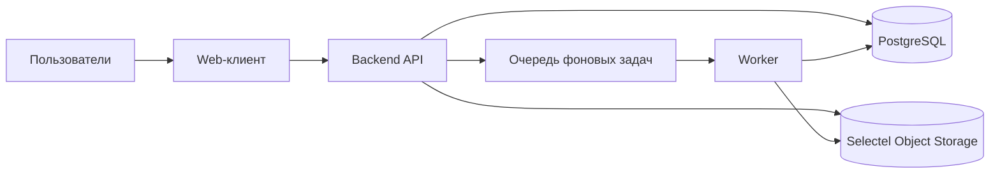
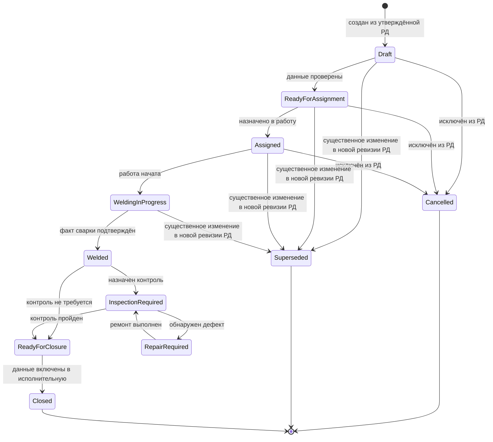
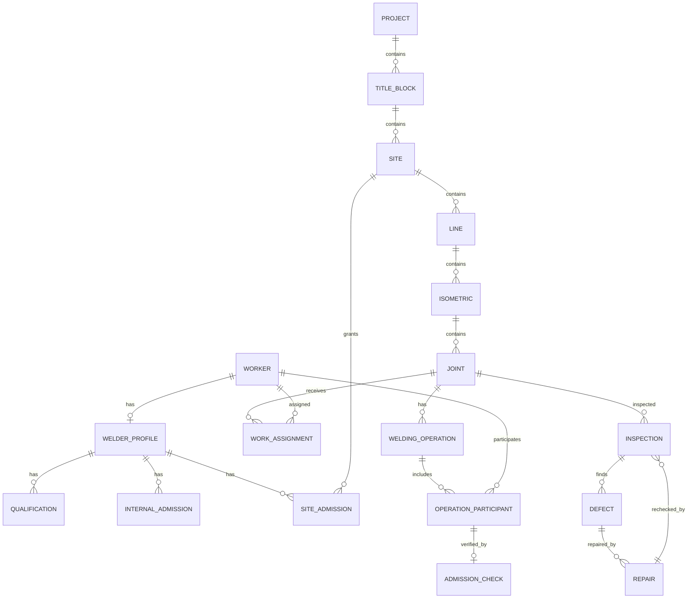
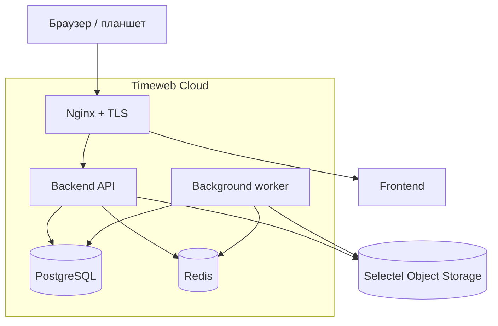

# Архитектура WeldPassport

> Главный архитектурный документ — [[docs/project/CONSTITUTION|Конституция проекта]].
> **Принцип №0 / AGF:** фундаментальные решения — только по
> [[docs/project/ARCHITECTURE_GOVERNANCE|Architecture Governance Framework]]:
> Session → ADR → документация → код
> ([[docs/project/CONSTITUTION#5. Architecture Governance|Конституция §5]]).  
> **Принцип №2:** новые сущности — сначала в
> [[docs/project/UBIQUITOUS_LANGUAGE|Ubiquitous Language]] (статус «Канон»);
> [[docs/project/CONSTITUTION#4. Архитектурный принцип №2. Канонический язык проекта|Конституция §4]].
> Этот файл описывает техническую реализацию принятых решений.

## 1. Архитектурное решение

Для MVP используется **модульный монолит**:

- web-клиент;
- единый backend API;
- PostgreSQL как основное хранилище;
- объектное хранилище для файлов;
- фоновые задачи для отчётов, импорта и уведомлений.

Микросервисы на первом этапе не нужны: основные операции проходят через один
сквозной производственный процесс и должны фиксироваться одной транзакцией.
Разделение выполняется внутри приложения по предметным модулям.


```mermaid
flowchart LR
    U["Пользователи"] --> WEB["Web-клиент"]
    WEB --> API["Backend API"]
    API --> DB[("PostgreSQL")]
    API --> FILES[("Selectel Object Storage")]
    API --> QUEUE["Очередь фоновых задач"]
    QUEUE --> WORKER["Worker"]
    WORKER --> DB
    WORKER --> FILES
```

## 2. Рекомендуемый технологический стек

### Backend

- Python 3.12;
- FastAPI;
- SQLAlchemy 2;
- Alembic;
- Pydantic;
- PostgreSQL 18;
- Celery или Dramatiq для фоновых задач;
- Redis как очередь и краткоживущий кэш.

### Frontend

- React + TypeScript;
- Vite;
- React Query;
- React Hook Form;
- компонентная библиотека Ant Design или MUI.

Для цеховых планшетов на первом этапе достаточно адаптивного web-интерфейса.
Отдельное мобильное приложение следует рассматривать после стабилизации
производственного процесса.

### Инфраструктура

- Docker Compose для разработки и первого развёртывания;
- Timeweb Cloud для размещения backend;
- PostgreSQL в Timeweb Cloud;
- Nginx с TLS перед backend;
- Selectel Object Storage через S3-совместимый API;
- резервное копирование PostgreSQL и файлового хранилища;
- централизованные логи.

## 3. Предметные модули

Backend делится на следующие модули:

| Модуль | Ответственность | Владелец |
|---|---|---|
| `identity` | пользователи, роли, права, сессии | Администратор |
| `projects` | проекты, объекты, участки | Проект |
| `engineering` | изометрии, ревизии, стыки (структура); РД — ПТО; WPS/PQR — ОГС | см. [[docs/project/ADR-006-domain-ownership-matrix|ADR-006]] |
| `hr` | работники, подразделения, должности, производственные роли | **ОК** |
| `welding` (`/api/v1/ogs`) | профиль сварщика, допуски, технология сварки, WPS, PQR, клейма | **ОГС** |
| `workforce` | **DEPRECATED** — legacy-таблицы `РАБОТНИКИ`, `СВАРЩИКИ` | переходный |
| `admissions` | внутренние допуски, допуски заказчика (целевой; часть в `welding`) | ОГС |
| `production` | задания, назначенные участники, подготовка, факт сварки | **СМР** |
| `quality` | приёмка, статус качества, дефекты, ремонты (ОТК); протоколы НК (НК) | **ОТК** + **НК** |
| `mto` | поставки, партии, плавки, сертификаты, учёт материалов | **МТО** |
| `documents` | комплект ИД, элементы, связи с фактами; файлы — вложения | **ПТО** |
| `reporting` | реестры, сводки, выгрузки Excel/PDF | — |
| `audit` | история изменений и значимых действий | — |

> **ПТО не принимает технологических решений по сварке.** WPS, PQR и допуски —
> владение ОГС. Матрица доменов — [[docs/project/DECISIONS#ADR-006. Матрица владения доменами|ADR-006]].
> Модуль `workforce` не используется для новых функций ([[docs/project/DECISIONS#ADR-005. Вывод legacy-модуля workforce из эксплуатации|ADR-005]]).
> **Стык (Joint)** — инженерная сущность из утверждённой РД и **центральный объект
> производственного процесса**; события жизненного цикла (WeldOperation, Inspection,
> NDTInspection, RepairOperation, ExecutiveDocumentation) привязаны к Joint
> ([[docs/project/ADR-007-joint-lifecycle-and-engineering-model|ADR-007]]).
> **ИД** — результат процесса, не файловый архив (ADR-006).

Модули не обращаются напрямую к внутренним таблицам друг друга. Внутри
монолита они взаимодействуют через сервисы приложения и явные интерфейсы.

## 4. Слои backend

```text
API
  -> Application services / Use cases
      -> Domain rules
          -> Repository interfaces
              -> SQLAlchemy repositories
                  -> PostgreSQL
```

- **API** проверяет формат запроса, аутентификацию и переводит ошибки в HTTP.
- **Application services** управляют сценарием и транзакцией.
- **Domain rules** содержат правила допуска, переходов статуса и закрытия.
- **Repositories** изолируют запросы к базе данных.
- SQLAlchemy-модели не должны одновременно быть API-схемами.

Пример use case:

```text
RecordWeldingFact
1. Загрузить стык и его текущий статус.
2. Проверить право пользователя на действие.
3. Проверить действующий допуск каждого фактического сварщика.
4. Зафиксировать участников и факт сварки.
5. Сохранить снимок результата проверки допуска.
6. Изменить статус стыка.
7. Записать событие аудита.
8. Зафиксировать всё одной транзакцией.
```

## 5. Главный агрегат и жизненный цикл

Центральная сущность системы — **стык (Joint)**. Каноническая иерархия контекста:

```text
Проект → Титул / Установка / Блок → Объект / Участок → Линия → Изометрия → Стык
```

Стык **рождается из утверждённой рабочей документации**, а не из факта сварки.
Неизменяемый системный идентификатор — `joint_id`; проектный номер (`project_joint_no`)
хранится отдельно и уникален только внутри иерархии (ADR-007).

**Joint** — инженерная сущность из утверждённой РД (`engineering`) и центральный
объект производственного процесса. **WeldOperation**, **Inspection**, **NDTInspection**,
**RepairOperation** и **ExecutiveDocumentation** — события или результаты жизненного
цикла этого Joint (модули `production`, `quality`, `documents`). Сварщик — участник
операции, не свойство стыка.

```text
РД → Joint → WeldOperation / Inspection / NDTInspection / RepairOperation / ExecutiveDocumentation
```


```mermaid
stateDiagram-v2
    [*] --> Draft: создан из утверждённой РД
    Draft --> ReadyForAssignment: данные проверены
    ReadyForAssignment --> Assigned: назначено в работу
    Assigned --> WeldingInProgress: работа начата
    WeldingInProgress --> Welded: факт сварки подтверждён
    Welded --> InspectionRequired: назначен контроль
    Welded --> ReadyForClosure: контроль не требуется
    InspectionRequired --> ReadyForClosure: контроль пройден
    InspectionRequired --> RepairRequired: обнаружен дефект
    RepairRequired --> InspectionRequired: ремонт выполнен
    ReadyForClosure --> Closed: данные включены в исполнительную
    Draft --> Cancelled: исключён из РД
    ReadyForAssignment --> Cancelled: исключён из РД
    Assigned --> Cancelled: исключён из РД
    Draft --> Superseded: существенное изменение в новой ревизии РД
    ReadyForAssignment --> Superseded: существенное изменение в новой ревизии РД
    Assigned --> Superseded: существенное изменение в новой ревизии РД
    WeldingInProgress --> Superseded: существенное изменение в новой ревизии РД
    Cancelled --> [*]
    Superseded --> [*]
    Closed --> [*]
```

Стыки **не удаляются** физически. При смене ревизии РД терминальные статусы:
`CANCELLED` (исключён) или `SUPERSEDED` (заменён новым Joint с новым `joint_id`).

Статус стыка нельзя менять произвольным редактированием поля. Каждый переход
оформляется отдельной командой с проверкой условий.

Полный текст решений — [[docs/project/ADR-007-joint-lifecycle-and-engineering-model|ADR-007]].
Каноническое ядро engineering-модели для MVP уточнено в
[[docs/project/DECISIONS#ADR-008. Каноническая модель предметной области WeldPassport (Session 003)|ADR-008]]
([[docs/project/ARCHITECTURE_SESSIONS#Architecture Session 003|Session 003]]).

### 5.1. Каноническое ядро engineering-модели (Session 003)

Joint остаётся центральным объектом производственного процесса (ADR-007). Для MVP
инженерный контур строится вокруг универсального источника **EngineeringDocument**
и самостоятельной сущности **Line**; изометрия — тип документа, а не корневая
сущность.

```text
Project
 ├── DocumentationPackage → EngineeringDocument
 ├── EngineeringDocument (document_type, document_number, revision, status)
 ├── Line (line_number, DN, среда, давление, …)
 ├── EngineeringDocumentLine (engineering_document_id ↔ line_id)
 └── Joint
      ├── project_id, line_id, source_engineering_document_id, joint_number
      ├── тип соединения (WeldShapeType / WeldJointDesignType / ProjectJointType)
      ├── геометрия (diameter_dn, diameter_outer, thickness)
      ├── материал (material_id + material_text_source)
      ├── engineering_status (draft | confirmed)
      └── status (производственный жизненный цикл)
```

Ключевые правила (детали — ADR-008):

| Правило | Суть |
|---------|------|
| Инженерное основание | Joint создаётся через `EngineeringDocument`, не «в проекте» напрямую |
| Рабочая привязка | Допускается `engineering_status = draft` по данным СМР; до закрытия ИД — `confirmed` (ПТО и/или ОГС) |
| Основной источник | Один `source_engineering_document_id` на Joint |
| Уникальность номера | `UNIQUE(project_id, line_id, source_engineering_document_id, joint_number)` |
| Line и документ | Связь many-to-many через `EngineeringDocumentLine`; у Joint всегда одна конкретная Line |
| Пакеты | `DocumentationPackage` учитывает передачу документации (частичный / полный комплект) |
| СМР / FOREMAN | СМР — производственный контур; факт сварки подтверждает роль FOREMAN (ADR-008, 003-A) |
| Материалы | `Material` → `MaterialGroup`; связь с `WelderAdmission.allowed_material_groups` |

Цепочка ответственности: **ОК → ОГС → СМР → ПТО → ОТК/НК → Закрытие**.

### 5.2. Каноническое lifecycle-ядро Joint (Session 003, продолжение)

Продолжение Session 003 (блок `003-M` — `003-Z`) уточняет, что `Joint` хранит
инженерную идентичность, а жизненный цикл фиксируется отдельными событиями и
проверками качества/технологии (детали — ADR-008).

```text
Project
 └── Line
      └── Joint
           ├── WeldOperation (включая operation_type = repair)
           ├── Inspection
           │    ├── NDTInspection
           │    └── HardnessInspection
           ├── Defect
           ├── RepairOperation
           ├── HeatTreatmentOperationJoint → HeatTreatmentOperation
           ├── Attachment → DocumentFile
           └── closure_status
```

Ключевые правила:

| Правило | Суть |
|---|---|
| Joint и операции | Один Joint может иметь несколько WeldOperation (слои, ремонт, переварка) |
| Комбинированная сварка | RAD + RD хранится как несколько WeldOperation, а не одно объединённое событие |
| WPS и допуск | Факт сварки может быть зафиксирован до верификации; до закрытия нужен review ОГС |
| Контроль и ремонт | `Inspection`/`NDTInspection`/`HardnessInspection` и `Defect`/`RepairOperation` разделяются |
| Термообработка | `HeatTreatmentOperation` — технологическое событие; возможны many-to-many с Joint и повторы |
| Файлы | Единый механизм `DocumentFile` + `Attachment` для всех доменов |
| Статусы | Статусы Joint разделяются по контурам (`production`, `inspection`, `documentation`, `closure` и др.) |
| Закрытие | Финальный контур — роль `CLOSURE_RESPONSIBLE` после проверки обязательных условий |

Production/Joints MVP использует **RACI-модель ответственности** по 10 каноническим
сущностям: Project, EngineeringDocument, Line, Joint, WeldOperation, Inspection,
Defect, RepairOperation, HeatTreatmentOperation, Attachment/DocumentFile
(решения 003-AB — 003-AM, ADR-008). NDTInspection и HardnessInspection — расширения
Inspection; DocumentationPackage и Joint closure описаны в 003-AL. Полная матрица —
[[docs/project/ARCHITECTURE_SESSIONS#Architecture Session 003 — RACI модель Production/Joints MVP|Session 003 — RACI]].

## 6. Ключевые правила модели данных

### Разделять человека и системного пользователя

- `worker` — физический работник предприятия;
- `welder_profile` — специализация работника как сварщика;
- `user_account` — учётная запись для входа в систему.

Не каждый работник имеет учётную запись, и не каждый пользователь является
работником.

### Разделять назначение и факт

Необходимо хранить отдельно:

- назначенного сварщика;
- фактического сварщика;
- участника подготовки;
- пользователя, внёсшего данные;
- сотрудника, подтвердившего факт;
- сварщика, указанного в исполнительной документации.

Это разные роли, даже если в конкретной записи их выполняет один человек.

Для сварочной операции фактический и документальный сварщик хранятся раздельно;
расхождения фиксируются и проходят проверку — см.
[[docs/project/ADR-002-double-welder-accounting|ADR-002: двойной учёт сварщика]].

### Допуск — результат правил, а не флаг

Проверка допуска должна учитывать:

- срок действия документов и аттестаций;
- способ сварки;
- группу материала;
- диапазон диаметров и толщин;
- тип соединения и положение сварки;
- внутренний допуск;
- допуск к объекту или проекту;
- дату выполнения работы.

Результат проверки сохраняется как неизменяемый снимок:

```text
admission_check
- worker_id
- joint_id
- checked_at
- work_date
- decision: allowed / denied / warning
- rule_version
- reasons[]
- source_document_ids[]
```

Это позволяет позднее доказать, почему система разрешила или запретила работу.

### История вместо перезаписи

Факты производства, результаты контроля, ремонты и допуски не удаляются и не
перезаписываются без следа. Исправление создаёт новую версию или корректирующую
запись. Для справочных данных допустимо мягкое удаление.

### Файлы отдельно от базы

В PostgreSQL хранится только метаинформация:

- владелец и тип документа;
- версия;
- имя и MIME-тип;
- размер;
- контрольная сумма;
- ключ объекта в Selectel Object Storage;
- кто и когда загрузил.

## 7. Минимальная структура данных MVP


```mermaid
erDiagram
    PROJECT ||--o{ TITLE_BLOCK : contains
    TITLE_BLOCK ||--o{ SITE : contains
    SITE ||--o{ LINE : contains
    LINE ||--o{ ISOMETRIC : contains
    ISOMETRIC ||--o{ JOINT : contains

    WORKER ||--o| WELDER_PROFILE : has
    WELDER_PROFILE ||--o{ QUALIFICATION : has
    WELDER_PROFILE ||--o{ INTERNAL_ADMISSION : has
    WELDER_PROFILE ||--o{ SITE_ADMISSION : has
    SITE ||--o{ SITE_ADMISSION : grants

    JOINT ||--o{ WORK_ASSIGNMENT : receives
    WORKER ||--o{ WORK_ASSIGNMENT : assigned

    JOINT ||--o{ WELDING_OPERATION : has
    WELDING_OPERATION ||--o{ OPERATION_PARTICIPANT : includes
    WORKER ||--o{ OPERATION_PARTICIPANT : participates
    OPERATION_PARTICIPANT ||--o| ADMISSION_CHECK : verified_by

    JOINT ||--o{ INSPECTION : inspected
    INSPECTION ||--o{ DEFECT : finds
    DEFECT ||--o{ REPAIR : repaired_by
    REPAIR ||--o{ INSPECTION : rechecked_by
```

> Каноническая иерархия и правила `joint_id` — ADR-007; engineering-ядро и уникальность
> `joint_number` — [[docs/project/DECISIONS#ADR-008. Каноническая модель предметной области WeldPassport (Session 003)|ADR-008]].
> Уровни `TITLE_BLOCK` и `LINE` обязательны в целевой модели; на ранних этапах
> могут быть свёрнуты во временные поля. Целевая ER-диаграмма engineering-контура
> — §5.1.

Для числовых характеристик нельзя использовать строки:

- диаметр и толщина — `numeric`;
- диапазоны допуска — отдельные `min`/`max`;
- даты — `date` или `timestamptz`;
- статусы и виды — справочники либо ограниченные enum-значения.

Идентификаторы рекомендуется хранить как UUID, а человекочитаемые номера
проекта, изометрии и стыка — как отдельные бизнес-атрибуты. Для стыка: неизменяемый
`joint_id` (PK) и `joint_number` (уникален в составе
`project_id + line_id + source_engineering_document_id`, см.
[[docs/project/DECISIONS#003-I. Уникальность JointNumber|ADR-008, 003-I]] и
[[docs/project/ADR-007-joint-lifecycle-and-engineering-model|ADR-007]]).

## Активное ядро MVP и отложенные модули

> Решение зафиксировано в [[docs/project/DECISIONS#ADR-003. Исключение модуля нормирования из активного MVP|ADR-003]] (2026-07-03).

### Активное ядро MVP

| Область | Схема / сущности | Статус |
|---|---|---|
| Работники | `hr.workers` | Реализовано |
| Роли работников | `hr.worker_roles` | Реализовано |
| Профиль сварщика (ОГС) | `welding.welders` | Реализовано |
| Допуски сварщика (ОГС) | `welding.welder_admissions` | Реализовано (v0.1) |
| Legacy работники/сварщики | `workforce` / кириллические таблицы | Deprecated (ADR-005) |
| Стык (инженерная модель) | `engineering.joints` | Проектирование (ADR-007) |
| Сварочные операции | `production.weld_operations` | Проектирование |
| Периодика КСС | `periodic_kss.*` | Проектирование |
| Контроль качества / НК | QC / NDT control results | Проектирование |
| Исполнительная документация | PTO executive documents | Проектирование |
| Закрытие стыка | joint history, закрытие | Проектирование |

Производственная цепочка MVP: **ОК → ОГС → СМР → ПТО → ОТК/НК → Закрытие**.

### Исключено из активного MVP (backlog / future modules)

| Область | Схема / сущности | Примечание |
|---|---|---|
| Группы материалов для норм | `norms.material_groups` | Только проектирование |
| Базовые нормы времени | `norms.base_norms` | Только проектирование |
| Нормы организации | `norms.org_norms` | Только проектирование |
| Расчёт норм времени сварки | операции `MARK_PIPE` … `QC_WELD` | Отложено |
| Калькулятор норм времени | — | Отложено |

Материалы проектирования модуля — [[10_Проектирование_WeldPassport/10_Нормы_времени/00_Нормы_времени|Нормы времени]].
Активный backend **не использует** схему `norms.*` и не должен на неё опираться.

## Модель организаций и проектов

Архитектурное решение:

```text
Не 1 фирма = 1 проект,
а Фирма ↔ Проект через роли.
```

В системе WeldPassport **не используется** правило «1 фирма = 1 проект». Связь
между организациями и проектами — **многие ко многим**: одна организация может
участвовать во многих проектах; один проект может включать несколько организаций.
Роль организации в конкретном проекте фиксируется через связующую таблицу
`project_companies`.

### Основные сущности

```text
companies
projects
project_companies
```

| Сущность | Назначение |
|---|---|
| `companies` | Справочник организаций/фирм |
| `projects` | Справочник проектов/объектов |
| `project_companies` | Связующая таблица между организациями и проектами; хранит роль организации в конкретном проекте |

### Минимальная структура `project_companies`

```text
project_id
company_id
role
```

### Примеры ролей (`role`)

```text
customer              — заказчик
general_contractor    — генподрядчик
welding_contractor    — сварочный подрядчик
ndt_lab               — лаборатория НК
inspection            — технадзор / инспекция
designer              — проектировщик
```

### Иерархия данных WeldPassport

```text
Организация / фирма
  ↕
Проект / объект
  ↓
Участок / линия / система
  ↓
Изометрия / чертеж
  ↓
Стык / сварное соединение
```

Связь `companies` ↔ `projects` реализуется через `project_companies` (многие ко
многим). Иерархия ниже уровня проекта (участок → изометрия → стык) относится к
производственному контуру и не смешивается с ролями организаций в проекте.

### Пример

```text
Проект: Газопровод Нагуман

Заказчик: ООО "Заказчик"
Генподрядчик: ООО "Генподряд"
Сварочный подрядчик: ООО "Монтаж"
Лаборатория НК: ООО "Контроль"
Проектировщик: ООО "Проект"
```

## 8. Авторизация

Используется RBAC с ограничением по области действия:

```text
permission = действие + тип ресурса
scope = организация / проект / объект
```

Примеры:

- ПТО может редактировать изометрии только доступных проектов;
- мастер может фиксировать факт по своему объекту;
- НК может вносить результаты контроля, но не менять факт сварки;
- главный сварщик управляет допусками;
- руководитель имеет доступ только на чтение и к отчётам.

Проверка прав выполняется на backend. Скрытие кнопки во frontend не считается
защитой.

## 9. API

Для MVP подходит REST API:

```text
/api/v1/projects
/api/v1/sites
/api/v1/isometrics
/api/v1/joints
/api/v1/workers
/api/v1/welders
/api/v1/admission-checks
/api/v1/work-assignments
/api/v1/welding-operations
/api/v1/inspections
/api/v1/reports
```

Бизнес-действия оформляются командами, а не универсальным обновлением статуса:

```text
POST /joints/{id}/assign
POST /joints/{id}/record-welding
POST /joints/{id}/request-inspection
POST /inspections/{id}/record-result
POST /defects/{id}/record-repair
POST /joints/{id}/close
```

Для защиты от повторной отправки мобильным интернетом команды записи должны
поддерживать `Idempotency-Key`.

## 10. Аудит и наблюдаемость

Для значимых действий сохраняются:

- пользователь;
- время;
- тип действия;
- сущность и её ID;
- старое и новое значение;
- причина исправления;
- IP и идентификатор запроса.

Пароли, токены и содержимое файлов в аудит не записываются.

Каждый запрос получает `correlation_id`, который проходит через API, фоновые
задачи и журналы приложения.

## 11. Развёртывание MVP


```mermaid
flowchart TB
    CLIENT["Браузер / планшет"] --> PROXY["Nginx + TLS"]
    PROXY --> FRONT["Frontend"]
    subgraph TIMEWEB["Timeweb Cloud"]
        PROXY --> BACK["Backend API"]
        BACK --> POSTGRES[("PostgreSQL")]
        BACK --> REDIS[("Redis")]
        WORKER["Background worker"] --> REDIS
        WORKER --> POSTGRES
    end
    BACK --> SELECTEL[("Selectel Object Storage")]
    WORKER --> SELECTEL
```

Backend, worker, Redis и PostgreSQL размещаются в Timeweb Cloud. Файлы хранятся
отдельно в Selectel Object Storage. Доступ к PostgreSQL должен быть разрешён
только из приватной сети backend и с административных адресов через защищённый
канал.

Для PostgreSQL настраиваются автоматические резервные копии и проверка
восстановления. Доступ к Selectel выполняется по HTTPS через отдельного
сервисного пользователя с минимально необходимыми правами на бакет.

## 12. Структура исходного кода

```text
backend/
  app/
    identity/
      api.py
      schemas.py
      services.py
      domain.py
      repository.py
      models.py
    projects/
    engineering/
    workforce/
    admissions/
    production/
    quality/
    documents/
    reporting/
    audit/
    shared/
      db.py
      errors.py
      security.py
  migrations/
  tests/

frontend/
  src/
    app/
    pages/
    features/
    entities/
    shared/
```

## 13. Этапы реализации

> **Сварной стык** остаётся центральной сущностью **производственного** контура
> (см. §5 и подраздел «Приоритет первого вертикального сценария»), но первым
> полностью реализуемым вертикальным сценарием является **кадрово-допусковый
> контур**; жизненный цикл стыка — второй.

1. Каркас приложения, миграции, пользователи, роли и аудит.
2. Работники, сварщики, документы, аттестации, внутренний допуск ОГС, разрешение
   на сварку, допуск заказчика — полный жизненный цикл работника до состояния
   «готов к назначению на объект».
3. Проекты, объекты, изометрии и стыки — второй вертикальный сценарий;
   жизненный цикл сварного стыка.
4. Назначение и фиксация факта сварки.
5. Контроль, дефекты, ремонт и повторный контроль.
6. Исполнительный журнал и выгрузки.
7. Импорт исходных реестров и эксплуатационные отчёты.

## 14. Решения, которые нужно уточнить до реализации

- нужна ли работа при нестабильной связи;
- кто окончательно подтверждает факт сварки;
- ~~допускается ли несколько сварщиков и несколько проходов на одном стыке~~ — **да**,
  через несколько `WeldOperation` и участников (ADR-007);
- какие виды НК обязательны и как определяется объём контроля;
- какие формы журналов и актов являются первыми обязательными выходными
  документами;
- нужна ли интеграция с Active Directory, 1С или внешней системой ПТО;
- перечень **существенных атрибутов** стыка, при изменении которых создаётся новый
  Joint (ADR-007, уточнить в доменных правилах `engineering`).

## 15. Владельцы данных по доменам

Канон границ — [[docs/project/CONSTITUTION#8. Домены и границы ответственности|Конституция §8]] ·
полная матрица — [[docs/project/ADR-006-domain-ownership-matrix|ADR-006]].

| Домен | Владелец | Ключевые сущности |
|---|---|---|
| Работники, кадры, роли | ОК | `hr.workers`, `hr.worker_roles` |
| Технология сварки, WPS, PQR, допуски, клейма | ОГС | `welding.*`, WPS/PQR |
| Факт выполнения, назначения | СМР | `production` — факт, участники |
| Рабочая и исполнительная документация | ПТО | РД, комплект ИД (не технология) |
| Статус качества, приёмка, дефекты | ОТК | `quality` — acceptance |
| Протоколы и результаты НК | НК | `quality` — ndt |
| Поставки, партии, сертификаты | МТО | `mto.*` |
| Стык (центральный объект, инженерная модель) | `engineering` | `joints`, `engineering_documents`, `lines`, материалы, ревизии |
| События жизненного цикла стыка | `production`, `quality`, `documents` | WeldOperation, Inspection, NDTInspection, RepairOperation, ИД |
| Нормирование | ОГС (отложено) | [[docs/project/DECISIONS#ADR-003. Исключение модуля нормирования из активного MVP|ADR-003]] |
| Справочники | Администратор | — |

> Роль «СМР» здесь новая относительно `05_Роли_и_права/WeldPassport_Роли_пользователей_v0.1.md` —
> при следующей проработке ролей сверить и привести к единому списку.

## 16. Статус backend-кода (обновлено 2026-07-06)

`09_Разработка/backend` — основная архитектурная база MVP.

**Подключённые роутеры (`app/main.py`):**

| Префикс | Модуль | Статус |
|---|---|---|
| `/api/v1/hr` | `app.hr` | активный (ОК) |
| `/api/v1/ogs` | `app.welding` | активный (ОГС) |
| `/api/v1` | `app.workforce` | **deprecated** (ADR-005) |

**Alembic-миграции (схемы `hr`, `welding`):** `hr_core`, `hr_worker_roles`,
`welding_welders`, `welder_admissions`.

Задачи стабилизации (этап 2026-07-06) **выполнены:** Конституция, ADR-004/005,
согласование `WeldingService`, `WELDING_MANAGED_TABLES` в `env.py`.

Следующий этап разработки: **production / joints** (без расширения legacy).

Определить дальнейшую судьбу `09_Разработка/src` (скрипты импорта) — влить в
backend или оставить отдельным слоём до миграции данных.

> Раздел перенесён из `docs/architecture/ARCHITECTURE_DECISIONS.md` (ADR-0011),
> файл в архиве — см. `2026-07-01_Ревизия_md_файлов_v1.md`.

## Архитектурная веха — 2026-07-01

По итогам независимой архитектурной ревизии (три согласованных анализа) зафиксировано:

- архитектура проекта признана **стабильной** — дальнейшая работа ведётся в рамках
  принятых решений, без пересмотра фундамента;
- **`09_Разработка/backend`** остаётся основной архитектурной базой MVP;
- **модульный монолит** подтверждён как целевой стиль backend;
- **PostgreSQL** подтверждён как единственная основная СУБД;
- отдельный **ETL-слой** на данном этапе **не создаётся** — импорт и обработка
  данных остаются внутри backend (Import Pipeline);
- разработка переходит от этапа **проектирования** к **инженерной реализации**;
- дальнейшая разработка ведётся **вертикальными бизнес-сценариями** (end-to-end
  по предметной области), а не горизонтальным наращиванием отдельных слоёв.

Подробные решения ревизии — в `docs/project/DECISIONS.md`.

### Приоритет первого вертикального сценария

Первым **полностью реализуемым** бизнес-процессом проекта становится не сварной
стык, а **полный жизненный цикл работника**.

Последовательность:

```
Человек
  ↓
Приём на работу
  ↓
Работник
  ↓
Сварщик
  ↓
Документы
  ↓
Аттестации
  ↓
Внутренний допуск ОГС
  ↓
Разрешение на сварку
  ↓
Допуск заказчика
  ↓
Готов к назначению на объект
```

Производственный процесс невозможно реализовать корректно без полноценной модели
работника, сварщика, аттестаций, внутреннего допуска, допуска заказчика и
разрешения на выполнение сварочных работ. **Только после прохождения этого
контура** работник может участвовать в производственном жизненном цикле сварного
стыка (назначение, подготовка, факт сварки, контроль, закрытие).

Вторым вертикальным сценарием остаётся полный жизненный цикл сварного стыка.
См. также `docs/project/DECISIONS.md` (запись «Изменение стратегии разработки»).

**Сварной стык** остаётся **центральной сущностью производственного контура**, но
первый этап разработки начинается с **кадрово-допускового контура** (цепочка
выше). Производственный контур невозможно реализовать корректно, если сначала не
создан фундамент: человек, приём на работу, работник, сварщик, документы,
аттестации, внутренний допуск ОГС, разрешение на сварку, допуск заказчика.
Только после этого работник может быть назначен на объект и участвовать в
жизненном цикле сварного стыка.

Краткая цепочка:

```
Человек → Приём на работу → Работник → Сварщик → Документы → Аттестации →
Внутренний допуск ОГС → Разрешение на сварку → Допуск Заказчика →
Готов к назначению на объект
```

---

## Связанные документы

- [[docs/00_PROJECT_CONTEXT|Контекст проекта]] — назначение, жизненный цикл, 7 модулей
- [[docs/project/DECISIONS|Журнал решений (ADR)]] — [[docs/project/DECISIONS#ADR-001. Модель организаций и проектов|ADR-001]] · [[docs/project/ADR-002-double-welder-accounting|ADR-002: двойной учёт сварщика]] · [[docs/project/DECISIONS#ADR-003. Исключение модуля нормирования из активного MVP|ADR-003: нормирование в backlog]] · [[docs/project/ADR-007-joint-lifecycle-and-engineering-model|ADR-007: жизненный цикл стыка]] · [[docs/project/DECISIONS#ADR-008. Каноническая модель предметной области WeldPassport (Session 003)|ADR-008: каноническая модель предметной области]]
- [[03_База_данных/Модель_организаций_и_проектов|Модель организаций и проектов]] · [[03_База_данных/WeldPassport_Реестр_сущностей_БД_v0.1|Реестр сущностей БД]]
- [[05_Роли_и_права/00_Ролевая_цепочка_ответственности|Ролевая цепочка ответственности]] · [[02_Процессы/WeldPassport_Процессы_v0.1|Процессы v0.1]]
- [[10_Проектирование_WeldPassport/03_Работники_и_сварщики/01_Модель_данных_Работники_и_сварщики_v0.1|Модель данных: работники и сварщики]] · [[10_Проектирование_WeldPassport/03_Работники_и_сварщики/02_План_реализации_Работники_и_сварщики_v0.1|План реализации]]
- Производственные узлы: [[02_Процессы/Сварочные_операции|Сварочные операции]] · [[02_Процессы/Неразрушающий_контроль|НК]] · [[10_Проектирование_WeldPassport/09_Периодика_КСС/00_Периодика_КСС|Периодика КСС]] · [[10_Проектирование_WeldPassport/05_Исполнительная_документация/00_Исполнительная_документация|Исполнительная документация]] · [[10_Проектирование_WeldPassport/11_МТО_и_материалы/00_МТО_и_материалы|МТО и материалы]]
- Отложенные модули (backlog): [[10_Проектирование_WeldPassport/10_Нормы_времени/00_Нормы_времени|Нормы времени]] — см. [[docs/project/DECISIONS#ADR-003. Исключение модуля нормирования из активного MVP|ADR-003]]
- [[docs/project/ROADMAP|Дорожная карта]] · [[docs/project/PROJECT_SUMMARY|Сводка проекта]]
