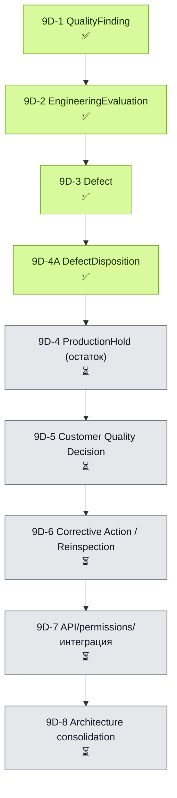

# WeldPassport — карта выполнения проекта

Источник состояния проекта: `docs/project/PROJECT_STATUS.yaml` (машиночитаемый) ·
[[docs/project/TASK_REGISTRY|TASK_REGISTRY.md]] (постатейный статус Tasks).

## Верхний уровень

```mermaid
flowchart LR
    A["Конституция + архитектура<br/>100% ✅"] --> B["ОК → Работники<br/>100% ✅"]
    B --> C["ОГС → Профиль + допуски<br/>100% ✅"]
    C --> D["Инженерный контур + WeldOperation<br/>100% ✅"]
    D --> E["ОТК → Контроль качества (9A-9C)<br/>100% ✅"]
    E --> F["ОТК → Task 9D Defect Management<br/>~55% 🔄"]
    F --> G["ПТО → Исполнительная документация<br/>5% ⏳"]
    G --> H["Закрытие истории стыка<br/>0% ⏳"]

    classDef done fill:#d9f99d,stroke:#65a30d,color:#1a2e05;
    classDef progress fill:#fef08a,stroke:#ca8a04,color:#422006;
    classDef planned fill:#e5e7eb,stroke:#6b7280,color:#111827;

    class A,B,C,D,E done;
    class F progress;
    class G,H planned;
```

## Завершённые этапы

- **Стабилизация ОК/ОГС (2026-07-06)** — [[docs/project/CONSTITUTION|Конституция]] ·
  [[docs/project/ADR-004-ogs-model-stabilization|ADR-004]] · [[docs/project/ADR-005-legacy-workforce-deprecation|ADR-005]].
- **Инженерный контур (Tasks 1–7, 2026-07-10…11)** — `Company/Project/Line/EngineeringDocument/Joint`
  (ADR-010/011).
- **WeldOperation и термообработка (Tasks 8A–8F, 2026-07-12…13)** — ADR-012/013/014.
- **Quality Execution Core (Tasks 9A–9C, 2026-07-13…15)** — ADR-015/016.
- **Task 9D-1…9D-4A (2026-07-19…21)** — `QualityFinding`, `EngineeringEvaluation`, `Defect`,
  `DefectDisposition` (ADR-019/021/022/023).

Полный список Tasks с коммитами — [[docs/project/TASK_REGISTRY|TASK_REGISTRY.md]].

## Текущий этап: Task 9D — Quality / Defect Management

## Где остановились

| Поле | Значение |
|---|---|
| Текущий этап | Task 9D, блок 9D-4A (`DefectDisposition`) завершён (`quality_defect_management_9d_in_progress`) |
| Ветка | `feature/engineering-joints-mvp` |
| Фокус | Завершить остаток блока 9D-4 (`ProductionHold`/`ProductionHoldRelease`), затем 9D-5 |
| Следующее действие | Реализовать `ProductionHold`/`ProductionHoldRelease` (см. [[docs/project/TASK_REGISTRY|TASK_REGISTRY.md]]) |
| Обновлено | 2026-07-21 |

## Правило ведения проекта

1. Состояние проекта фиксируется в `docs/project/PROJECT_STATUS.yaml`, а не в чате.
2. Постатейный статус Tasks — в [[docs/project/TASK_REGISTRY|TASK_REGISTRY.md]].
3. Архитектурные принципы — в `docs/project/CONSTITUTION.md`.
4. После изменения статуса модуля/Task обновлять `PROJECT_STATUS.yaml`, `TASK_REGISTRY.md`
   и эту карту.
5. Чат — для обсуждения; источник правды — файлы репозитория.
