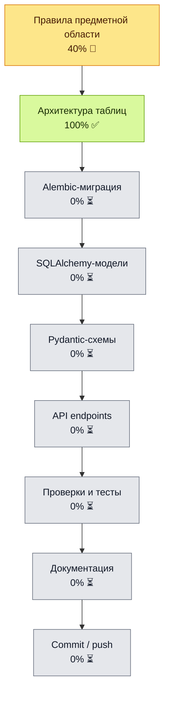

# WeldPassport — карта выполнения проекта

Источник состояния проекта: `docs/project/PROJECT_STATUS.yaml`

## Верхний уровень

```mermaid
flowchart LR
    A["Архитектура<br/>90% ✅"] --> B["ОК → Работники<br/>100% ✅"]
    B --> C["ОГС → Допуски сварщика<br/>25% 🔄"]
    C --> D["СМР → Факт выполнения<br/>0% ⏳"]
    D --> E["ПТО → Исполнительная<br/>0% ⏳"]
    E --> F["ОТК → Контроль качества<br/>0% ⏳"]
    F --> G["Закрытие истории стыка<br/>0% ⏳"]

    classDef done fill:#d9f99d,stroke:#65a30d,color:#1a2e05;
    classDef progress fill:#fde68a,stroke:#d97706,color:#451a03;
    classDef planned fill:#e5e7eb,stroke:#6b7280,color:#111827;

    class A,B done;
    class C progress;
    class D,E,F,G planned;
```

## Текущий этап: ОГС → Допуски сварщика

ER-схема этапа: `docs/diagrams/ogs_welder_admissions_er.mmd`

## Где остановились

| Поле | Значение |
|---|---|
| Текущий этап | ОГС → Допуски сварщика (`ogs_welder_admissions`) |
| Ветка | `feature/ogs-welder-admissions-mvp` |
| Фокус | ОГС → Допуски сварщика v0.1 |
| Следующее действие | Спроектировать таблицы допусков сварщика и связь с `worker_id` |
| Обновлено | 2026-07-03 |

## Правило ведения проекта

1. Состояние проекта фиксируется в `docs/project/PROJECT_STATUS.yaml`, а не в чате.
2. После изменения статуса модуля или внутреннего шага обновлять YAML и эту карту.
3. Чат — для обсуждения; источник правды — файлы репозитория.
