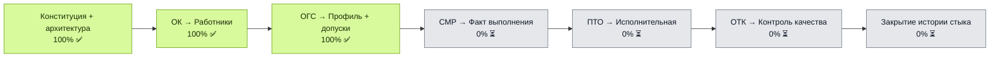
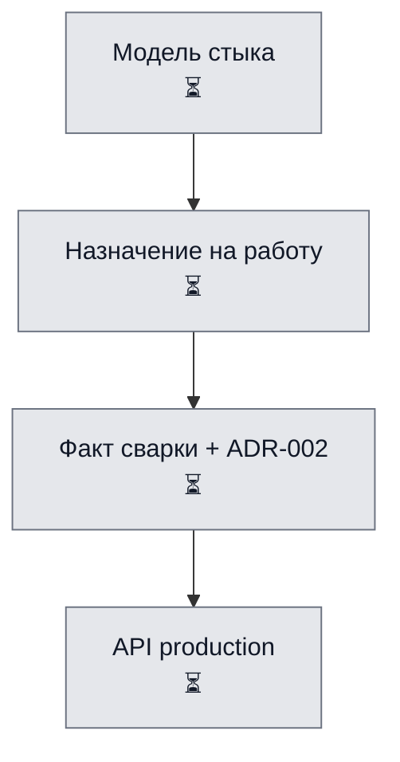

# WeldPassport — карта выполнения проекта

Источник состояния проекта: `docs/project/PROJECT_STATUS.yaml`

## Верхний уровень

## Завершённый этап: стабилизация ОК/ОГС (2026-07-06)

- [[docs/project/CONSTITUTION|Конституция проекта]]
- [[docs/project/ADR-004-ogs-model-stabilization|ADR-004]] — модель `welders` / `admissions` / `stamp_code`
- [[docs/project/ADR-005-legacy-workforce-deprecation|ADR-005]] — deprecated `workforce`
- Сервисный слой: `WeldingService.create_admission` согласован с архитектурой
- Alembic: `WELDING_MANAGED_TABLES` включает `welder_admissions`

## Следующий этап: СМР → production / joints

## Где остановились

| Поле | Значение |
|---|---|
| Текущий этап | Стабилизация ОК/ОГС завершена (`ok_ogs_architecture_stabilized`) |
| Ветка | `feature/ogs-welder-admissions-mvp` |
| Фокус | Готовность к этапу production / joints |
| Следующее действие | Спроектировать `production.joints` и жизненный цикл стыка |
| Обновлено | 2026-07-06 |

## Правило ведения проекта

1. Состояние проекта фиксируется в `docs/project/PROJECT_STATUS.yaml`, а не в чате.
2. Архитектурные принципы — в `docs/project/CONSTITUTION.md`.
3. После изменения статуса модуля обновлять YAML и эту карту.
4. Чат — для обсуждения; источник правды — файлы репозитория.
